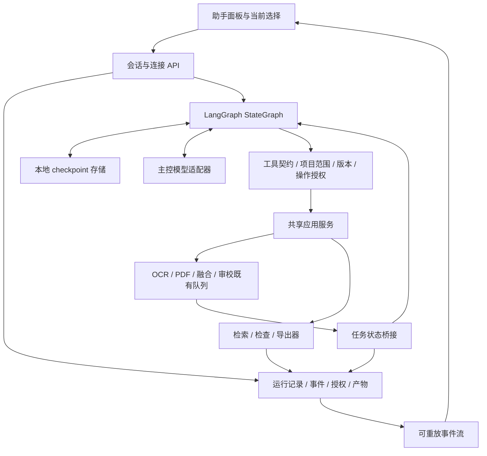

# OCR 文档助手 Agent 完整开发计划

初版：2026-09-20；修订：2026-09-21；计划版本：2（LangGraph）。状态：**P0 已完成；本轮调整后续计划，LangGraph 接入尚未实施**。

源码基线：当前工作区 `0.13.0rc1`、SQLite schema 12、Python 3.12、FastAPI、React 19。工作区包含尚未提交的其他专项改动，正式实施前重新记录文件哈希及基线；本计划不假定 HEAD 等于已交付版本。

配套入口：

- [35 项任务及依赖](ocr-agent-development-tasks-20260920.json)：保留原任务 ID，新增 B00 框架验证。
- [验收与评测计划](ocr-agent-acceptance-plan-20260920.md)：确定性检查、真实模型评测、发布判定。
- [开源调研](../research/ocr-agent-20260920/REPORT.md)：DeepSeek Harness、OpenCode、DeepAgents 的固定提交证据。

当前架构以 [LangGraph 决策](ocr-agent-langgraph-adr-20260921.md) 为准，后续执行入口为 [v2 下一步](ocr-agent-next-20260921.md)。[P0 历史回执](ocr-agent-p0-results-20260920.md) 记载已完成的契约、策略和夹具；除此之外的新模块、API、数据库与框架接入仍为待实现设计。冻结回执、测试成绩和封存集不倒改。

## 1. 产品目标与首版范围

交付工作台内的自然语言文档助手。用户指定目标后，助手可以理解当前文档与选择范围，查询内容，组织 OCR/原生提取，等待后台任务，检查财务和结构疑点，发起局部视觉审校，生成可追溯的导出，并通过证据跳回原文。

首版成功场景：

| 场景 | 用户指令 | 可交付结果 |
| --- | --- | --- |
| S01 批量处理 | “把这份 PDF 前 20 页识别出来，表格汇总为 Excel。” | 范围明确的处理任务、成功/失败页清单、可再次下载的工作簿 |
| S02 财务疑点 | “检查这张表的合计，告诉我差在哪里。” | Decimal 检查事实、差额/单位/舍入说明、单元格引用 |
| S03 局部审校 | “复核第 8 页选中的金额。” | 原图证据、模型建议、沿用现有采用/拒绝/撤销入口 |
| S04 失败恢复 | “只重跑刚才失败的页，再导出。” | 对应任务的失败子集、无重复成功任务、更新产物 |
| S05 文档定位 | “找到应收账款那张表并打开。” | 采用结果中的检索命中、带页码的候选、有效跳转 |
| S06 继续任务 | “刚才中断了，继续。” | 先核对旧任务和输入版本，再恢复未完成部分 |

首版包含两种主控接口适配：OpenAI 兼容 Chat Completions 工具调用、Anthropic Messages 工具调用；内网部署可使用兼容端点。主控模型与现有视觉审校模型分别配置。完整离线主控作为候选运行模式验证，不预先承诺某个现有视觉模型通过工具调用评测。

首版不实现通用 shell/代码执行、任意 SQL/网络工具、自动安装插件、多 agent 协作、向量数据库、跨项目问答、自动跨页拼表、新 OCR 模型训练、无范围限制的自动改字。现有项目导入继续由工作台入口完成，助手可引导打开导入界面，但不获得任意文件读取权限。图片透视/去噪等复杂预处理先使用已有明确配置，不增加模型自由生成变换参数。

## 2. 技术决策

| 决策 | 首版选择 | 理由与复评条件 |
| --- | --- | --- |
| 运行框架 | Python LangGraph StateGraph 嵌入 FastAPI | 由框架承担调度、检查点和 interrupt/resume；不嵌入 DSH、不自研平行执行引擎 |
| Agent 形态 | 单主控、多回合、有限工具 | 已有业务工具完成重任务；主控只组织任务和解释结果 |
| 业务执行 | 共享应用服务，复用既有队列 | 保留 GPU 串行、review-only、版本校验、维护锁和恢复语义 |
| 状态归属 | 图保存执行位置/消息；业务 SQLite 保存操作/授权/任务/产物 | 两库不共享原子事务，以 operation ID 核对；UI 是可重建投影 |
| 工具协议 | 原生 tool call + 服务端参数/输出校验 | 不从自由文本中猜测并执行命令；不以正则提取任意“操作 JSON”替代能力验证 |
| 界面事件 | 带 Bearer 的 fetch SSE；断流后按游标补读 | 复用本机鉴权；原生 EventSource 不能直接附加现有 Authorization 头 |
| 模型输出 | 先完整响应工具回合；阶段性展示真实步骤 | 首版必须有进度事件；逐 token 文本输出不作为完成首版的前提 |
| 图像 | 主控默认文字；视觉交给现有审校工具 | 节省上下文与协议复杂度；避免暗中把所有页面发给主控 |
| MCP | 工具契约预留适配，首版不部署 MCP server | 需要外部 agent 接入时再提供同一业务契约 |
| 依赖 | 锁定 LangGraph、saver 及传递依赖；模型先用现有 httpx 基础 | B00 验证 Windows Python 3.12 离线 wheel；无需 LangSmith 服务，禁用外部 tracing；不是零新增依赖 |

借鉴 DeepSeek 的执行前/执行后管线、配对会话事件；借鉴 OpenCode 的工具输入输出校验、结果限额和可见进度；不复制它们的编程工具默认权限或直接嵌入整套 UI。

模型自主选择工具、参数与后续步骤，图规定合法执行边界，不写死唯一业务顺序。使用专用工具节点，保留 P0 整批验证与写操作串行约束，不直接采用默认并行执行所有调用的 ToolNode。

## 3. 总体结构和源码边界



建议新代码放入 `src/ocr_workbench/agent/` 包，不把运行器、路由、协议、工具全部写入 `service.py`。具体文件名可在实现时细化，但责任边界不变。

| 模块 | 主要责任 | 既有接入点 |
| --- | --- | --- |
| `agent/contracts.py` | 严格输入、输出、事件、引用和错误类型；导出前端 schema | 当前 Pydantic 运行时与 `frontend/src/agentTypes.ts` |
| `agent/store.py`、`agent/migrations.py` | 业务操作、调用、授权、run 投影、事件和产物 | 业务 SQLite 事务和迁移；不维护第二套图执行历史 |
| `agent/providers.py` | 两协议多轮消息、工具配对、供应商能力与响应验证 | 复用 `external_review.py` 的 HTTP/DPAPI 基础，保留审校协议 |
| `agent/connection.py` | 独立主控连接、无敏感数据探针、配置快照 | CredentialVault、settings 或新配置表 |
| `agent/graph.py`、`agent/state.py` | StateGraph 节点/条件边、消息 reducer、待处理调用 | 复用 P0 契约与业务校验 |
| `agent/checkpoints.py` | 官方 saver 生命周期、thread 映射、图版本兼容 | 独立本地 SQLite，B00 验证；不自研 checkpoint 引擎 |
| `agent/runtime.py` | 薄适配器：执行租约、预算、取消、invoke/resume | 调用 graph.ainvoke/astream，不另写步骤调度循环，不占 OCR GPU 线程 |
| `agent/policy.py`、`agent/context.py` | 项目/范围能力、选择快照、证据阅读、摘要 | pages/results/selections/revisions |
| `agent/registry.py`、`agent/tools.py` | 工具白名单、服务端验证、有限输出 | 共享应用服务 |
| `agent/jobs.py`、`agent/operations.py` | 长任务状态桥接、幂等、重试关联 | `TaskQueue`、`Documents`、外部/融合队列 |
| `agent/artifacts.py` | 持久导出、原子发布、下载租约、保留和清理 | `exporting.py`、`pdf_export.py`、maintenance |
| `agent/routes.py`、`agent/events.py` | 会话 API、SSE、补读、生命周期 | `service.py:create_app` |
| `application_services.py` | 提取 UI 与 agent 共用的提交/检查/导出业务入口 | `service.py`、document/multimodal/structure routes |
| `frontend/src/AgentPanel.tsx` 与 agent 子组件 | 会话、任务卡、证据跳转、澄清、产物、连接 | App、WorkspaceLayout、api、现有 review 组件 |

测试文件单独按协议、状态、任务、产物、策略和交互组织。仅提取本功能需要的业务入口，避免以此为由重写完整 Store 或所有现有路由。

## 4. 运行状态、并发和恢复

### 4.1 三层状态

- **Session**：项目绑定的对话容器，`active/archived`；不与单次任务成功失败混用。
- **Run**：一次用户目标及其执行，`queued/running/waiting_jobs/waiting_user/completed/failed/cancelled/interrupted`。
- **Operation/Call**：具体工具动作；调用协议状态与业务任务状态分别记录，允许同一业务任务被多个读取调用观察。

这些是应用业务/展示状态。下一节点、消息和挂起位置归 LangGraph checkpoint；run.status 不再独立驱动相同的执行状态机。每个 session 绑定服务端生成的 graph_thread_id，每个 thread 仅允许一个 invoke/resume。客户端不能指定任意 thread/checkpoint ID；run ID、generation 和图版本记录当前目标。

状态转换：接收指令后 `queued → running`；需等业务任务时 `waiting_jobs`；范围不清、具体修订决策、达到预算或部分结果决策时 `waiting_user`；返回有效答复且请求范围已结算后 `completed`。`completed` 同时带 `outcome=success/partial/answered` 和覆盖清单，不等于所有页面全部成功。

进程异常退出时，未终结 run 标为 `interrupted`；启动只做本地核对，不自动重发模型请求或自动恢复 OCR。用户点击继续后核对关联任务、版本、配置、授权和预算，按照现有队列恢复规则处理。

### 4.2 并发规则

每个会话最多一个活跃 run；同一项目首版最多一个拥有写操作权的 agent run，其他会话可查看历史但写执行排队。手动 UI 编辑仍可发生，由 revision 校验处理竞争。全应用主控 HTTP 并发初始上限 2；每步只读工具最多并发 3；写工具按模型给出的顺序串行，不并行修改同一结果。

不持有 SQLite 事务、maintenance.guard 或 GPU 锁跨越网络等待。短事务完成状态/任务提交后再唤醒已有队列。运行器设置 owner generation 与递增 fencing token；旧执行协程/线程恢复后不得继续写入已被取消或接管的 run。

### 4.3 模型循环与异步工具配对

每次模型响应先完整验证，再执行工具；部分返回的 JSON、重复 call ID、截断参数不能执行。对于同一步的多个调用，所有 call 都有明确 result 或错误，保持协议配对顺序。

图按职责拆分为 `model → validate_batch → execute_next → await_jobs/await_user → collect_results → model/finalize`，条件边支持查询、直接回答与多工具步骤。整批参数先验证，写工具逐个执行，只读调用按上限并发；同一步所有结果按原 call ID/顺序配对后才进入下一模型回合。

execute_next 只幂等提交长任务并保存 operation/job 引用；提交动作不放进含 interrupt 的等待节点。await_jobs 查询任务，未结束则 interrupt 挂起并释放图执行；桥接器在任务终结后通过同一 thread 和精确 interrupt 标识发出 Command(resume=...)。等待节点重入后再次查询业务数据库，不信任 resume payload 自报的成功。等待不持有长运行栈或 GPU 锁、不反复请求模型、不把 queued 当完成。

等待期间由任务桥接器查询真实状态；建议活跃轮询间隔 1 秒，长等待退避到 5 秒，仅查询关联 ID。唤醒使用唯一 resume marker；重连、多次通知和重启核对只能触发一次后续步骤。UI 断开不取消后台 run。

防止任务在等待 checkpoint 建立前已完成：先保存 job link/等待意图，挂起后再核对一次，后台对账扫描补漏。正常运行中的 waiting_jobs 自动恢复；waiting_user 等对应用户决定；重启后的 interrupted 等显式继续。不能因都使用 interrupt 而混淆三种语义，也不能吞掉 GraphInterrupt 后当作普通工具失败。

LangGraph 恢复会重放节点；消息、事件、预算扣减用稳定 ID 去重。框架 recursion_limit 是图步数，不等于 12 次模型请求预算，必须分开计数。模型节点不配置盲目 RetryPolicy，具体恢复规则见第 7 节。

### 4.4 用户追加消息与停止

运行中普通追加消息进入可见 inbox，在工具步骤安全边界消费，并重新冻结新范围；不静默并发开第二个写 run。更改目标/范围会取消尚未提交的旧计划步骤，已提交任务保留明确关联。

提供两个清楚的动作：

1. “停止助手”：立即阻止新模型/工具调用，取消当前模型 HTTP 等待；已提交 OCR 继续，UI 显示它们仍在执行。
2. “停止并取消本轮任务”：同时请求取消本轮创建且允许取消的业务任务；复用已有任务只解除等待，不取消其他调用方的工作。

取消使用 run generation 防止迟到返回触发新动作。外部供应商可能已处理请求，界面不宣称供应商已撤回。正常退出按 agent 停止接单 → 取消网络等待 → 持久化中断状态 → 停止任务观察 → 既有队列退出的顺序完成；不终止其他项目或进程。

## 5. 数据库设计与升级

业务记录沿用 `workbench.sqlite3`，使任务提交与幂等记录同事务落地；图使用独立 `agent-checkpoints.sqlite3` 和官方 async SQLite saver，避免侵入框架私有表。业务 schema 暂定 13，若已占用则顺延；checkpoint schema/version 单独维护，不写业务 user_version。

上游 SQLite saver 有生产写吞吐限制说明，此处仅作为单机低并发候选；B00/F06 验证锁竞争、恢复和空间增长。失败先定位、收紧并发或验证兼容官方版本并写 ADR，不默认给便携工作台引入 PostgreSQL/云服务。

| 表 | 关键字段/约束 | 用途 |
| --- | --- | --- |
| `agent_sessions` | id、project_id FK、graph_thread_id UNIQUE、graph_version、title、status、created/updated | 项目绑定和服务端线程映射 |
| `agent_runs` | id、session_id、client_request_id、request_hash、status、outcome、generation、context/config/limits 快照、usage、last_event_seq | `UNIQUE(session_id,client_request_id)` 防双击；同 key 不同请求返回冲突 |
| `agent_model_requests` | request_id、run_id、step、input_hash、state、normalized_response、usage | 模型发送/回包恢复日志，避免重放盲目再次付费；不是第二份对话历史 |
| `agent_events` | session_id、seq、run_id、type、payload、created | `PRIMARY KEY(session_id,seq)`；状态与事件原子更新，重连按 seq 补读 |
| `agent_calls` | id、run_id、step、provider_call_id、tool/version、canonical_args、state、operation_id、result_ref | `UNIQUE(run_id,step,provider_call_id)`；未知/截断调用不执行 |
| `agent_operations` | id、project_id、run_id、operation_key、input_hash、generation、state、result、error | 可重复投递的副作用记账；相同 key 相同参数复用，相异参数冲突 |
| `agent_job_links` | operation_id、job_kind、job_id、ownership、input_revision、last_state | `UNIQUE(operation_id,job_kind,job_id)`；区分 created/reused，支持失败子集 |
| `agent_decisions` | id、run_id、kind、payload_hash、scope/revision/config、status、reply、expires | 澄清/外发范围/修订采用/部分结果决策；已批准的同范围动作复用 |
| `agent_artifacts` | id、project_id、run_id、operation_id、relative_path、sha256、bytes、mime、manifest、state、expires、pinned | 产物及下载清理生命周期；只允许应用生成的相对路径 |

取消 v1 的独立 agent_messages/agent_summaries 表：模型消息、供应商续接块、摘要及覆盖游标由 graph state/checkpoint 持有；UI transcript 是应用 events 的显示投影，不能反向驱动模型恢复。state 只含可序列化数据和稳定引用，不保存 Key、连接、队列实例、PIL 对象；服务对象经运行上下文注入。

两库不构成分布式事务。恢复先核对业务 operation，再修复图与 UI 投影；旧 checkpoint 重放获取已有提交结果。业务已提交而 checkpoint 落后、checkpoint 已前进而 UI 事件未发布均需补偿，应用事件以稳定键去重；不能以写了两个库为由宣称原子一致。

主控连接保存一个独立配置，模型/协议/地址/能力探针版本与 credential_ref 分离；Key 不进消息、任务、日志、报告或导出。首版不做多个主控连接的路由市场，但会话运行快照固定使用哪一版配置。

新增索引覆盖 session 列表、活跃 run、任务反查、artifact 过期查询；实现前对预计 10 万事件的分页查询检查执行计划。消息与产物可能包含文档正文，项目删除/备份/迁移说明必须明确覆盖这些数据。

升级流程：只读检查未来 schema → 使用 SQLite backup API 备份 → 单事务迁移 → 外键与完整性核验 → 记录回执。不得复制仍在写入的 SQLite 主文件充当完整备份。迁移失败回滚；旧程序继续拒绝未来 schema。

两库备份前停止新 agent 工作并让业务写入进入静止点，分别使用 backup API 保存一致备份集合及 manifest；不得发布半套备份。记录框架、graph/state/serializer/checkpoint schema 版本；节点改名、删除或 reducer 变化须测旧挂起会话兼容。不能兼容时保留记录、核对副作用后创建新会话，不在新图上盲目续跑。项目删除同时清除关联 thread checkpoint，checkpoint 纳入占用和保留/压缩策略。

回退分两类：同 schema 的 agent 功能开关可关闭新入口；回到旧二进制必须停止服务并恢复迁移前数据库及对应文件快照到隔离目录，升级后新数据不会自动兼容旧版，不允许直接降 `user_version`。

## 6. 工具契约与业务语义

所有工具：严格 schema，拒绝未知字段；页码整数且从 1 开始；资源 ID 必须解析到会话项目；输出大小有限；每次返回 evidence_refs 和读取到的 revision。模型不提供 project_id、credential_ref、绝对文件路径、幂等 key 或授权结果，这些由运行器注入。

统一结果字段：`status`、`summary`、`data`、`evidence_refs`、`job_refs`、`artifact_refs`、`error`、`truncated`、`next_cursor`。`error` 含 code、用户可读信息、是否允许重试以及所需处理；不回显 Key、原始鉴权头或全量供应商异常正文。

| 工具 | 必要输入和限制 | 服务端行为 | 分类 |
| --- | --- | --- | --- |
| `get_workspace_context` | 当前选择 token，可选分页 cursor | 返回项目内文档、选中页/格、能力和队列摘要；不自动读取所有全文 | 只读 |
| `search_document` | document_id、query 1—200 字、limit≤50、cursor | 搜索采用版本并返回页/目标/版本；未 OCR 页提示缺失覆盖 | 只读 |
| `read_page_result` | page_id、source=`adopted/run_result`、result_id 条件必需、table/target 范围 | 默认采用结果；run_result 仅允许本轮关联结果，明确是否 adopted | 只读 |
| `process_pages` | document_id、明确页集、auto/native/ocr、可用引擎、force 默认 false | 提交既有 PDF stages；沿用锁定/解锁、review-only 和版本限制 | 异步写 |
| `run_ocr` | 当前范围 version_ids、1—4 引擎、可选现有融合配置 | 原子幂等提交；不根据名称虚构引擎，PP-OCR 文字结果不冒充结构表 | 异步写 |
| `inspect_table` | result_id、revision、table_id、checks | 返回现有结构/财务证据；需要生成结构候选时单独记账任务，不将写动作藏在只读查询 | 只读或显式异步检查 |
| `request_visual_review` | result_id、revision、version_id、target IDs、已配置视觉模型 | 固定快照并提交现有审校；仅输出建议；不让模型选择新网络地址 | 异步写/可能外发 |
| `get_job_status` | 本轮或本会话关联 job refs，limit≤100 | 服务端校验归属，返回真实终态和结果；常规等待由运行器完成 | 只读 |
| `retry_failed_jobs` | 指定前序 run/operation、失败 job refs、明确 retry/resume | 只处理允许重试的失败集合；建立新 operation 并保留旧关联 | 异步写 |
| `export_results` | 当前结果集合或本轮结果范围、格式、aggregate、confirmed_only、partial_policy | 冻结导出 manifest；生成持久 artifact；范围不全时不静默丢页 | 异步产物 |
| `navigate_to_evidence` | 服务器发出的 evidence ref | 返回已验证导航建议；用户点击跳转，默认不打断正在手工编辑的页面 | UI 建议 |
| `ask_user` | 具体缺失信息、有限选项、关联范围 | 持久化澄清项并挂起；不能借该工具批准自身副作用 | 用户交互 |

`inspect_table` 的只读/写模式分成不同 schema 或明确 `action` 枚举并绑定不同权限，不用自然语言参数决定风险分类。首版不向模型提供直接 `save_result`、任意改单元格或标记“人工确认”的工具。

### 6.1 “新结果”和“采用结果”不能混淆

当前 `Store.complete` 对尚无选择的图片可能自动建立初次选择，但不会普遍替换已有采用结果。agent 继承当前行为，不因一次“重识别”自动覆盖已有手工采用版本。

因此查询明确返回 `result_id/revision/version_id/is_adopted/source_run_id`。批量导出默认使用本轮清单指定的结果，不暗中读取旧选择；`confirmed_only=true` 仍必须通过现有采用状态和复核版本检查。依赖采用版本的结构/视觉审校暂不支持对未采用新结果执行时，提示用户选择已有结果采用入口，不绕过原校验。

多引擎结果存在分歧时提供对比或现有融合候选；模型不凭自述置信度擅自替换人工校订。任务已完成但部分表缺结构时，产物清单标出未能形成表格的页面。

### 6.2 完整性与部分成功

运行记录保存 requested_pages、completed_pages、failed_pages、skipped_pages、result_manifest。默认部分失败进入 `waiting_user`，提供“重试失败页/仅导出成功页”具体选择；如果用户已明确允许部分结果则按授权继续。产物标题、manifest 和答复都显示覆盖范围；不能把部分工作簿标记为整份成功。

## 7. 幂等、重试与崩溃一致性

操作 key 由服务端根据 run、逻辑动作 ID、工具版本和规范化输入生成；业务输入哈希含版本/页集/引擎包/预处理/配置版本。tool_call_id 只用于协议配对，不能作为跨模型重试唯一去重依据。

同一目标内重复语义调用映射到已有逻辑动作；用户明确要求再次重跑才创建新 retry intent。相同参数合法重复与网络重放通过显式意图区分，不能全局按参数永久去重。

| 副作用 | 设计 |
| --- | --- |
| 普通 OCR/融合提交 | 在 Store 事务中写 operation 和 tasks/links；普通 OCR 补齐 request_id 去重，现有手动调用不带 key 仍兼容 |
| 文档 stages | 保留现有参数/版本缓存语义；在同事务建立 operation→stage 关系；`force=true` 重放不再创建新 stage |
| 审校提交 | 复用已有 request_id 与 snapshot 验证，再原子关联 agent operation；失效配置/版本不能重用旧操作 |
| 审校采用 | 仍走现有决定 API；采用 token 绑定 proposal 与 revision；重复提交返回同一决定或明确冲突 |
| 导出 | 先 durable pending → 独立临时目录生成 → 校验哈希 → 同盘原子发布 → DB 标记 ready；崩溃后核对发布文件而非盲目重做 |

需要提取接受现有 db 事务对象的内部业务 helper，避免在一个 transaction 内再调用自行开启 `BEGIN` 的方法。事务提交后唤醒队列；若在唤醒前退出，启动/恢复可从任务记录找到工作。

网络 GET/本地只读可有界重试；生成式 POST 在响应是否被供应商接收不明时，不自动重发。记录 `provider_outcome_unknown`，保留预算消耗不确定标记，再由显式重试继续。工具参数错误最多允许主控修正 2 次；同工具同错误连续 2 次后停止该路径并给出可操作结果。

验收必须覆盖：记账前崩溃、提交事务后回包前崩溃、任务完成后恢复前崩溃、文件发布后 DB 提交前崩溃。目标是业务效果去重与可核对恢复，不宣称跨进程绝对 exactly-once。

图的业务提交节点初始采用同步 checkpoint 持久化配置，但仍保留幂等，因为执行与检查点之间仍有故障窗口。模型发送前记录 request_id/input_hash，回包后先保存经验证响应再返回图；重放复用已记录响应，发现 sent 但无可靠回包则暂停并标记结果未知，不自动再 POST。interrupt 前的逻辑可能重入，因此等待决定与实际采用/提交必须在不同节点。

## 8. 模型接入、上下文和预算

### 8.1 连接和协议

复用 DPAPI，不复用审校接口的“必须能看图并返回审校 JSON”准入条件。主控连接表单选择协议、URL、模型和 Key；配置页显示数据接收地址及作用范围。仅用户主动拉模型、测试或运行时联网；程序启动和打开项目不探活供应商。

连接测试使用生成的无业务数据，要求模型调用固定 `probe_echo` 工具并消费返回值完成第二回合。记录工具调用、结果消费、多回合和所需 token 参数能力。探针失败显示“不支持工具调用”或具体协议错误，不降级成可执行的自由文本方案。

两协议适配需处理：call ID 配对、多个 tool calls、无工具的答复、拒绝/截断、未知 tool、JSON 类型错误、HTTP 401/403/429/5xx、超时、取消、模型上下文上限。供应商要求续传的 reasoning/signature/opaque blocks 作为协议私有字段保存并原样续接，不显示为用户执行依据；不兼容提供方明确标记不支持。

地址规范化、证书验证、重定向/代理策略沿用当前外部 HTTP 设计；不默认引入自定义头、Azure 专有鉴权或 Responses。后续协议扩展以独立适配器实现。

配置修改后递增 revision。未发送的下一回合需重新核验配置；旧 run 不静默切换服务地址/模型。复用凭据引用需考虑删除与活跃请求：清除连接阻止后续发送，已发送结果只作为旧配置证据处理，不能因此发起新动作。

### 8.2 上下文管理

第一回合只附项目/选择摘要和工具定义。正文按工具读取；长表按行/单元格范围分页。记录真实使用的页码、result revision、工具 schema 版本和 prompt 版本。

达到上下文预算的 70% 时优先减少历史大工具结果，保留引用；确需摘要时进行一次受预算限制的摘要请求。不能切断 tool-call/result 配对，也不能仅凭模型摘要恢复授权、已完成状态或新旧结果关系。图片不进入主控默认上下文。

遇到用户切项目，旧会话继续绑定原项目；新项目独立会话。当前页面变化只改变下一条新消息附带的 selection token，既有 run 的范围不变。

### 8.3 初始限额（开发默认值，须经性能评测校准）

| 项 | 初始值/行为 |
| --- | --- |
| 单 run 主控模型请求 | 最多 12 次，含参数修正和摘要 |
| 单 run 工具调用 | 最多 40 次；批量页处理计一次工具调用，业务子任务另外计数 |
| 单次处理页数 | 默认最多 100 页；明确选择更大范围可分批，整轮最大 1000 页 |
| 单 run 引擎任务总量 | 默认最多 400；扩大需修改本轮可见预算，不能靠分批绕过 |
| 工具返回 | 单工具最多约 16 KiB 文字/JSON；分页使用稳定 cursor，大证据存本地引用 |
| 模型 HTTP | 每请求总时限初始 180 秒；connect/read 分别设界；等待业务队列不占此限额 |
| 模型上下文 | 使用实际模型能力上限与配置 cap 的较小值；未知模型需设保守 cap，预留输出空间 |
| token | 单 run 累计预算初始 64k 估算输入输出 token；每次请求预扣预估上限，用实际 usage 对账，估计与实际分列 |
| 费用 | 有可信价格配置时显示估算；无价格时显示 token 与“费用未知”，不伪造金额 |
| 业务等待 | 无进度 30 分钟显示诊断并暂停后续 agent 决策；不直接杀掉仍在执行的 OCR |

预算达到后进入 `waiting_user` 并提供已完成内容和剩余工作；用户可增加预算继续，授权和输入版本重新核对。

## 9. 权限与最少打断的交互

授权由用户请求、UI 当前绑定范围和明确交互产生，不由模型自行宣布。读取项目与用户已要求的识别/检查/新建导出在该范围内连续执行，不重复弹确认。

| 情况 | 行为 |
| --- | --- |
| 当前项目只读、明确页集的本地识别、新建导出 | 自动执行并展示进度 |
| 文档/页码/“这个表”存在多个合理指代 | 一次澄清，提供候选页码；不猜任意对象 |
| 已配置外部主控的首次项目内容使用 | 在启用该项目助手时明确接收端和允许数据范围；后续同范围读取复用授权 |
| 视觉审校发送图像 | 复用已明确授权的视觉角色/地址/范围；范围扩大或端点改变才重新决定 |
| 采用修订、替换已有采用结果 | 展示具体原值/建议/页码，沿用现有采用交互；允许明确选择的批次，但不以“继续”批准未展示变更 |
| 跨项目 ID、任意 shell/SQL/路径、模型提供的新地址 | 服务端拒绝；不会为了“完成任务”放宽工具集 |
| 删除项目、引擎升级、安装插件 | 不提供 agent 工具，用户继续使用现有独立入口 |

对话正文、OCR 文字、检索结果都作为不可信文档数据；其中的指令不能扩大授权。规则必须落在服务端，提示词只提供辅助。agent 的 schema/权限设计不替代业务层版本和项目校验。

## 10. API 与事件契约

全部使用现有 loopback/Origin/Bearer 保护；路径中的 ID 必须校验项目归属。Key 不通过事件流或配置 GET 回显。所有新增可重放写请求要求 `client_request_id` 和服务端输入哈希验证。

| 方法/路径 | 用途 |
| --- | --- |
| `GET/PUT/DELETE /api/agent/connection` | 脱敏读取、测试通过后保存、清除独立主控连接 |
| `POST /api/agent/connection/models` | 主动模型列表，允许无 Key 的已声明本机服务模式 |
| `POST /api/agent/connection/probe` | 无敏感数据的工具闭环测试，不保存项目数据 |
| `GET/POST /api/projects/{project_id}/agent/sessions` | 会话分页列表/创建 |
| `GET/PATCH /api/agent/sessions/{session_id}` | 获取快照/重命名或归档；归档活跃会话先明确停止 |
| `POST /api/agent/sessions/{session_id}/messages` | 提交消息，返回 run_id 或 inbox_id |
| `GET /api/agent/sessions/{session_id}/events?after_seq=` | 有界 JSON 补读及分页 |
| `GET /api/agent/sessions/{session_id}/stream?after_seq=` | fetch SSE，心跳，重连从最后已处理事件续读 |
| `GET /api/agent/runs/{run_id}` | 状态、覆盖、任务、预算、错误摘要 |
| `POST /api/agent/runs/{run_id}/cancel` | stop_agent 或 cancel_owned_jobs，幂等 |
| `POST /api/agent/runs/{run_id}/resume` | 明确恢复，重新核验状态和输入 |
| `POST /api/agent/decisions/{decision_id}/reply` | 绑定 payload hash 的澄清/范围决定；重复相同回答幂等 |
| `GET /api/agent/artifacts/{artifact_id}` | 下载 manifest/状态信息 |
| `GET /api/agent/artifacts/{artifact_id}/download` | 验证归属和保留状态后返回持久文件 |
| `PATCH/DELETE /api/agent/artifacts/{artifact_id}` | UI 保留标记或清理；不暴露给主控工具 |

SSE 事件统一带 `session_id/run_id/seq/type/created/payload`。事件类型至少覆盖 message、run state、tool started/finished、job progress、decision required/resolved、artifact ready、budget updated、error。进度 coalesce，避免逐 token 或每个 OCR 回调都写持久事件。

同一状态变更和事件在单事务发布；先注册通知再读取缺失事件或直接以 DB 游标为真值，避免订阅建立窗口漏事件。UI reducer 去重 seq，并检查 run generation；快照包含 `through_seq`，快照与增量不会互相覆盖。慢客户端有界缓冲，断开后补读；401 停止重连并触发现有会话失效 UI。

上述原子性仅限应用 DB。LangGraph astream/updates/custom 通过 adapter 映射为应用事件，不把框架原始块变成前端稳定协议，也不宣称与另一库的 checkpoint 同事务。checkpoint ID 仅作内部对账引用；前端仍按应用 seq 补读。

## 11. 界面与产物

### 11.1 助手面板

沿用 Fluent UI 和当前视觉规范，不做全站重设计。宽屏右侧可收起面板，初始建议约 380—440 px；窄屏或高度不足时单独工作视图，保留返回原图/校对入口。

顶部显示绑定项目、当前附带的文档/页/选择、主控模型与连接状态。输入区显示“包含当前选择”，用户可清除；清除后不暗中继续带上原选择。项目切换创建/切换对应会话，发送前保存明确 context token。

消息支持流转状态、任务覆盖、错误原因、重试入口；证据显示页码与定位；修订复用既有建议卡；产物显示文件名、类型、生成范围、过期/保留状态。Markdown 禁用 raw HTML 和任意脚本/外部自动资源，证据链接只由应用引用解析。

首次未配置主控时显示配置入口和仍可使用的本地 OCR 能力。键盘支持 Enter 发送/Shift+Enter 换行、Escape 关闭面板而非取消任务；状态更新使用可访问 live region，焦点不随后台进度被抢走。

### 11.2 产物生命周期

新产物位于 `workspace/agent-artifacts/{project_id}/{artifact_id}/`，不放在现有 `exports/export-*`：后者既会在下载后删除，也会在服务启动时清理。

产物 manifest 记录 run、页集、result/revision/version、引擎、覆盖和失败页、是否采用/人工确认、导出参数、字节数和哈希。导出输入须冻结一致快照，快照变化时不会悄悄换用更新结果。

默认未保留产物保存 30 天；用户可标记保留。临时失败目录下一次启动核对后清理。磁盘不足按现有磁盘策略加产物配额提示，拒绝新大导出；不因达到配额删除保留产物。下载期间加读租约，清理不得删除正在读取的文件；过期/丢失/损坏分别返回明确状态，不能返回死链接还声称存在。

maintenance 的占用统计、孤儿识别、隔离、项目删除和备份范围纳入 agent 目录及表。项目删除先停止该项目 run 和关联观察器，按现有队列保护处理文件，再完成一致性清理；不误删其他项目或共享配置凭据。会话归档不删除原始 OCR 与已保留产物。

## 12. 分阶段实施和任务依赖

计划包含 35 项任务，保留原 34 个 ID，新增 B00。A01—A03 按 P0 回执视为已完成，不重复执行；其余按 v2 的框架责任边界实施。默认单执行者，独立工程不以真实凭据为前提。

| 阶段 | 任务 | 交付物与通过条件 | 初步工作量 |
| --- | --- | --- | --- |
| P0 基线与契约 | A01—A03 | 已有契约、测试、夹具继续使用 | 已完成，不计剩余 |
| P1 框架与基础设施 | B00—B05 | 离线依赖、图恢复小实验、两库边界、共享服务和探针 | 4—6 人日 |
| P2 只读助手 | C01—C05 | StateGraph 工具循环、引用、事件与上下文 | 3—5 人日 |
| P3 执行闭环 | D01—D06 | OCR/PDF 任务、幂等、等待、失败重试、持久导出、取消恢复 | 5—8 人日 |
| P4 审校和完整体验 | E01—E05 | 财务检查、视觉建议、采用/撤销、富交互、离线模式边界 | 4—6 人日 |
| P5 加固与评测 | F01—F06 | 协议/故障/边界/UI/真实模型/性能证据与修复 | 5—8 人日 |
| P6 文档和交付 | G01—G04 | 使用说明、冻结包、干净 Windows 验证、发布资格回执 | 3—5 人日 |

P0 之后剩余粗估 **24—38 人日**，不是与 v1 含 P0 的总量直接比较的提速承诺。框架减少通用机制维护，业务一致性、UI 和包验证仍需完成，B00 后校准。假设一名熟悉代码的开发者、现有引擎可用，不含外部等待；阶段不是逐次索要批准的关卡。

关键依赖：已完成 A01/A02→B00→B01/B04；B02 可独立做服务提取；B01→B03；B04→B05；B00+B01+B03+B04→C01；C01+C02→C03→C04；C05 集成 saver 和上下文；D01/D02/D03 接入异步业务；D04/D05/D06 完成产物与恢复；E02/E03 完成审校；F/G 判定发布资格。JSON 为精确依赖依据。

B00 在隔离构建环境验证离线导入、简单工具循环、interrupt 重入、完成早于挂起、双库对账和无外部 tracing，不改生产依赖，不需要真实凭据。随后优先以 get_workspace_context/read_page_result/process_pages/export_results/ask_user 五个既有契约贯通最小链路，其余工具按阶段补齐；不得把固定脚本路径冒充模型自主工具选择。

只读工具和 UI 可以在协议模拟下开发；真实 API 凭据缺失不阻塞迁移、幂等、队列、UI、文档和离线包准备。但没有真实模型闭环证据，不能把完整 agent 标为生产验证通过。

真实可行性应尽早验证：B05 在已有授权配置可用时立即跑无敏感双回合探针；C04 的只读闭环完成后，先用 3—5 条开发集任务做真实主控烟测，检查“中文意图 → 工具 → 引用 → 回答”。这不是等到 F05 才第一次接真实模型，也不能代替 F05 的独立封存评测。烟测失败优先判断模型能力与契约，最多两条合理适配路径后切换已授权候选；缺凭据则明确保留缺口，继续独立工程。

## 13. 验收、修复和发布判定

2026-09-24 阶段调整：优先在本机实验工作区拉起项目供用户看效果。演示门槛限于当前源码后端/前端回归、前端构建、当前候选包审计、短时服务/UI 烟测及项目范围、授权、凭据、产物和恢复的基本数据安全检查；结果记 `demo_ready` 并说明使用模拟或真实主控。真实独立主控 72 次、干净目标机、物理断网、跨用户 DPAPI、旧版完整回退、当前候选约 29 GB 全量搬迁及生产性能门槛转到后续 `production_qualified`，不阻塞本机演示。用户取消新的四小时混合长轨，历史 failed/not_qualified 回执仍有效，长期稳定资格不据短测外推。精确分层见[验收计划](ocr-agent-acceptance-plan-20260920.md)，当前证据见[发布状态](../audit/ocr-agent-20260921-langgraph/release-status.json)。

验收分四条证据线：工程正确性、真实主控任务成功率、OCR/审校内容质量、交付环境兼容性。每条分别标 `pass/fail/not_tested/conditional`，不能用模拟协议通过代替真实模型效果，也不能用 agent 编排成功代替 OCR 准确率。

配套验收计划定义固定用例和定量门槛。关键不变量包括：零越项目操作、零未授权修订、故障注入中零重复业务效果、零静默丢页的“完整成功”、零 Key 泄露、旧版本结果不覆盖新编辑。失败必须修复或关闭受影响能力，不能降低门槛后称通过。

真实评测先用已授权模型与合成/公开材料；不要求用户先提供私有文档或手工标注。至少一套已验证主控配置通过闭环才允许声明该配置支持 agent；另一个协议只有模拟证据时，明确标记尚未实测。

每个阶段运行受影响测试；最终执行完整后端、前端和构建，再运行冻结包验证。已有命令：

```powershell
$env:PYTHONPATH = "$PWD\src"
python -m unittest discover -s tests -v
```

```powershell
npm --prefix frontend test
npm --prefix frontend run build
```

新增审核脚本和参数在实现时提供完整 `--help`，此计划不提供尚不存在的可执行命令。UI 证据优先外部 Playwright/Chromium，加 `--disable-gpu`、`--disable-gpu-compositing`；如用 Codex 内置浏览器，先停止其他线程浏览器活动，批量截图后待界面稳定再做收口，不能把重启作为常规步骤。

## 14. 执行记录、遇阻处理和变更控制

本轮授权为调整计划，不启动 B00—G04 实施。后续沿用 P0 的 codex/ocr-agent 工作成果并核对现场，不重复创建基线或从旧 HEAD 重建。当前入口为 docs/ocr-agent-next-20260921.md；历史 audit 的 NEXT.md 保留为当时证据。

每次执行使用 `audit/ocr-agent-<run>/` 与 `build/ocr-agent-<run>/`。audit 保存 baseline、task-state、decisions、tests、model-evaluation、release-status、NEXT；build 保存测试项目、原始响应、导出和包。真实运行状态写独立回执，计划 JSON 保持设计初始状态。

任务状态 `pending/running/done/blocked/failed`；blocked 仅描述该任务的实际依赖，不阻止独立任务。任务 done 需有输出路径和验收证据。证据缺口写 `evidence_gaps`，不把失败用例标记 done-with-gaps。

| 障碍 | 后续动作 | 结论边界 |
| --- | --- | --- |
| 无可用主控凭据或调用授权 | 完成模拟协议、工程、UI、打包；真实测试保留 not_tested | 不自动使用已有视觉连接发送文本或产生费用 |
| 模型不支持原生工具调用 | 探针失败并禁用该模型的 agent；尝试已配置且授权的替代 | 不自由文本解析执行 |
| 两条合理兼容路径均失败 | 保存错误和最小复现，隔离该模型，继续其他模块 | 不在单一供应商上无限等待 |
| GPU 被其他工作占用 | 继续 CPU/协议/UI/文档；稍后验证真实 OCR | 不结束他人进程 |
| 没有干净 Windows 机器 | 完成当前机器包内测试、搬迁测试、离线验证，输出目标机脚本 | 干净机资格 not_tested，不能声称全环境发布通过 |
| 现有回归失败 | 与冻结基线比较，修复本次引入问题；旧问题独立记录 | 不把所有失败归咎旧代码，也不无关扩张修复范围 |
| 真实质量低于门槛 | 优先修契约/提示/工具范围，开发集最多 3 轮明确变体；保留失败轨 | 不反复调同一封存集或改评分降低标准 |

所有新增依赖、schema、工具权限和范围改变写 ADR；已明确授权范围内的常规实现不重复询问用户。新增付费服务、扩大外发范围和覆盖既有交付物须有具体授权依据。

## 15. 发布与后续路线

采用 feature flag：未配置主控时入口可见但不联网，原 OCR 不依赖 agent。工程完成且真实证据不足时可交付标明范围的实验包；正式支持的协议/模型名单仅列有证据的组合。

打包包括服务源码、前端静态资源、配置 schema、锁定 wheel、许可证、迁移、使用说明和诊断脚本；不包含用户凭据、研究原始业务数据和真实会话。复用现有构建/锁定/ZIP 验证流程，在新输出目录产生包与 SHA256 回执，不覆盖历史交付 ZIP。

发布前做同机/中文路径搬迁、无 Node 开发环境、断网 OCR、配置 API 时仅目标地址网络、review-only、Windows DPAPI 换用户提示、异常退出恢复、升级备份、关闭 agent 回退验证。最终记录源码/前端/包哈希一致性，避免“源码修好而便携包没更新”。

后续优先级：先补通过实测的离线主控配置；再考虑 MCP 适配、批次模板、受控批量采用；多 agent、语义检索、跨页表逻辑合并只在首版用例证明有需求且独立评估后启动。

**首版完成定义：** 用户在一个已验证主控配置下，可以在工作台内完成 S01—S06；明确看到执行范围、实际进度、失败页、证据和产物；重试/取消/恢复不会重复提交或覆盖新编辑；最终包和文档与被测源码一致，未验证的供应商与设备条件如实标明。
