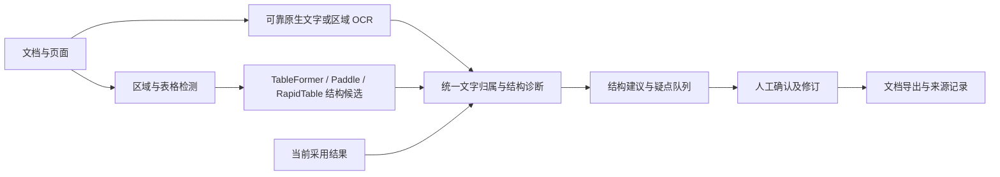

**DeloitteOCR 下一阶段开发计划：真实 PDF 表格结构与复核效率**

制定日期：2026-09-16。依据当前源码、文档工作流实施记录及 2026-09-15 实验、2026-09-16 独立复核。本文是待执行计划，新增规模、工期和收益均为建议，不能视为已完成或已测结果。

**1. 本轮要交付什么**

主目标：让高频真实 PDF 中的表格更接近可直接使用，并减少整份文档的人工核对时间。

首个版本交付完整流程：导入文档 → 逐页提取 → 检查表格结构 → 集中复核疑点 → 保存修订 → 批量导出。算法主线是采用结果的结构可靠性，重点解决漏行漏列、合并格、表头层级和一页多表；定位对应继续复用既有能力。

首批场景暂定为原生 PDF 财务报表及附注明细，兼顾中文；第二类是扫描明细及原生/扫描混合文档。这个顺序是基于项目用途和现有公开材料作出的规划假设，M0 用实际可取得样本校准。拿不到业务材料时先用公开财务文档开发，将结论限定在公开场景。

本轮核心产物：结构候选与差异诊断、结构修正建议、文档级复核队列、真实整页评测、独立新测试及可复现交付。跨页表格合并放到下一版本，入口条件见第 10 节。

**2. 从现有成果继续开发**

| 当前事实 | 本轮决策 |
|---|---|
| 已有文档—页面—区域关系、原生提取、区域 OCR、导航、人工绑定、修订和 PDF 导出 | 扩展现有模块，不重建文档系统或表格编辑器 |
| 最新裁剪测试：TableFormer + local-v3 控制轨覆盖 77.50%，实际采用结构轨 69.71% | 保留为历史基线，新增真实整页基线；两个轨道不能替代整页检测验收 |
| 实际轨有 1,734 个参考目标无法关联采用输出 | 优先检查漏行、错列、跨度及多表身份；这些不是 1,734 次模型调用失败，也不能全部直接归因于结构错误 |
| 实际合并格覆盖 43.75%，其中 153/352 个合并格无可关联采用输出 | 结构和跨度修正列为首批任务，单纯增加邻居锚点规则不足以解决问题 |
| 重复值覆盖已从 57.30% 提高到 72.98% | 固定 local-v3 作主对应器，local-v2 保留回归对照；不立即开启新一轮对应器扩张 |
| 7 份公开 PDF、14 页仅有工程接入证据 | 补独立标注，才能形成中文、扫描、多表和整页质量结论 |
| 当前默认仍是 Paddle + local-v2，TableFormer/local-v3 属实验选项 | 默认切换必须走独立验收，不能以计划中的目标代替测量 |

本轮主要利用以下已有模块：`native_tables.py`、`geometry_providers.py`、`table_matching.py`、`page_processing.py`、`review_issues.py`、`TableEditor.tsx`、`QuickReview.tsx`、`RegionPreview.tsx` 和现有导出模块。缓存等已知问题随相关流程一起验收，不单独占据研发主线。

**3. 借鉴哪些上游，做到什么程度**

以下基于此前固定源码的研究和本次本地源码核对，不代表重新比较了所有项目的最新版本。新增复用先做小范围兼容验证，再锁定来源与必要修改。

| 上游 | 已明确的实现方式 | 本轮复用与边界 |
|---|---|---|
| Docling / Docling Parse | PDF 文字带原生坐标，表格阶段使用已有文字单元与结构模型结果匹配 | 沿用词/字符及坐标提取；扩展现有原生表格预览为可复核结构候选。保留可靠性判定和来源 |
| TableFormer `TFPredictor`、OTSL | 输出结构序列、跨度和模型框；匹配后的处理可能压缩行列编号 | 直接使用已经接入的原始结构和 OTSL 解析，保留原始编号及转换关系，生成候选骨架 |
| TableFormer `CellMatcher` | 用相交面积相对文字块面积生成文字—单元格候选 | 复用已有适配与排他判定，填充候选结构时沿用同一文字归属器；正相交不等于可靠归属 |
| TableFormer `MatchingPostProcessor` | 有重复列处理、孤立文字归属、列对齐；部分处理将框改成文字包围范围 | 先评测其差异提示和候选生成价值；删列、孤立文字强制归属及重新编号不直接写入采用结果。原始完整格框与文字范围分开 |
| RapidTable 3.0.2 | 接收外部 OCR，输出结构与跨度 | 继续保留固定 OCR 对照；补同一填充/对应器下的结构对照，辨别收益来自骨架还是文字处理 |
| PaddleX 表格子管线 | 检测、结构、后处理各阶段组合成结果 | 保留当前默认路线、整页表区域与阶段来源，作为产品基线和检测对照 |
| Microsoft Table Transformer / GriTS | 提供表格拓扑、内容及位置评估工具 | M0 核验官方评分实现及许可后固定使用，避免重写结构相似度。新数据的标注转换须做小样本交叉检查 |

Camelot/pdfplumber 的公开 PDF 可继续作开发材料。第一轮不同时增加一套专用规则提取引擎；如果 M0 证明主要失败来自规则线清晰的原生表格，再用一个受控开发试验判断是否值得加入。

拟定处理关系如下，模型候选、采用结果和人工修订分别保存：

TableFormer 提供结构证据，不因此获得额外文字投票。结构选择与文字内容选择各自记录，原图始终是核验入口。

**4. M0：建立场景、基线和数据协议，4–6 个开发人日**

先回答三个问题：常用文档是哪类；人工时间主要消耗在哪个环节；结构错误中哪两类影响最多。利用已曝光案例诊断，再建立新文档基线，不重复此前的大规模裁剪扩样。

具体工作：

1. 先选 10–15 份开发文档，跑通当前版本的完整流程，记录整页表格检出、整表可用性、结构错误及时间。包含原生中文表、扫描表、混合页、多表页和无表页。
2. 复查现有实际轨的无关联目标，区分真实漏格/跨度错、文字错误、参考身份关联拒绝和一表拆成多表。离线诊断可看标注，生产选择器不得使用这些答案。
3. 确定首个版本的主要场景与两个优先结构问题，默认从合并格/多级表头、漏行漏列开始。
4. 固定当前源码、策略、默认处理路线及模型清单，留作整页和人工复核基线。已有用户工作区改动属于基线的一部分，记录文件清单与哈希，不只记 Git HEAD。
5. 冻结数据资格、评分协议和第 8 节业务目标。首轮基线若说明建议目标不合理，可在此调整并说明原因；看过最终测试后不能追改门槛。

建议数据规模：

| 集合 | 建议规模 | 用途 |
|---|---|---|
| 历史材料 | 已曝光的裁剪实验及公开 PDF | 错误诊断、回归和算法开发，保留原报告 |
| 新真实 PDF 开发集 | 30 份文档，至少 60 页、60 张表 | 改进结构建议、页面路由和交互，可反复分析 |
| 验证集 | 20 份文档，至少 40 页、40 张表 | 比较预先登记方案，选择阈值和候选采用策略 |
| 新封存测试集 | 至少 100 份独立文档、200 页、120 张表、6,000 个完整目标格 | M5 一次性质量判断；不足则降低结论范围，不能用历史测试补数 |

最终测试在满足独立文档数基础上，争取覆盖：至少 30 份中文文档、20 份确认来源的物理扫描、10 份混合文档；至少 30 个多表页、30 个无表页；合并格不少于 300 个、重复值格不少于 500 个、空格不少于 200 个。属性可以重叠，按实际达到的规模报告。材料难以取得时，M0 明确哪些场景只能继续作为试验范围。

按原始文档和相似模板分组，页、裁剪、重渲染、旋转/降质版本不得跨集合。排除本项目所有已准备和已曝光文档，包括 2026-09-15 的测试及候选池；历史 584 文档只是上一轮起点，还需并入此后的全部清单。使用文件哈希、图像近重复及版式/文字近重复检查。

标注包括整页表区域、行列与跨度、文字、表头关系、完整格边界及关键字段。原生 PDF 提取和模型结果可以辅助标注，但必须逐项核对原图；不能直接把任何一个被测模型的预测作为真值。全部表格结构与关键金额/编号至少二次复核，歧义项目在推理前仲裁。无法确定完整格边界时，单列可评的结构/文字指标，不强造框；此类样本不冒充完整几何验收集。

正式边界继续使用 `full_grid`，`text_extent`、`pdf_cell_extent` 分开。新财务或扫描材料的网格标注规则在开发阶段写清楚，不能未经验证把 PubTables 的具体构造规则套到所有数据上。

退出条件：场景范围、基线报告、分组清单、标注说明及验收协议可复现。测试样本及标签在新方案推理前封存，调参程序默认只访问开发/验证集。

**5. M1：建立结构候选与差异诊断，4–5 个开发人日**

目标是让系统准确指出“表格哪里需要检查”，为结构修正提供依据。

在已有候选与编辑模型上增加轻量结构视图，保留页面/区域、提供方、模型版本、原始格 ID、行列跨度、几何类型、文字 token ID 和转换来源。无需另建一套文档数据库。

首批差异类型：

- 表身份：一页多表混淆、一张表拆成两张、两张表合成一张。
- 行列：漏行、额外行、漏列、额外列，以及只影响局部的错位。
- 合并格：跨行/跨列跨度不同，合并与拆分不一致。
- 表头：多级表头层级不同、表头与正文边界不同。
- 内容归属：文字未归属、同一来源文字被重复占用、跨格文字和重复值歧义。

所有差异都显示当前结构、候选结构和相关原图区域。候选彼此一致只是一项证据，不能视为真值；同源模型之间的一致也不能算多份独立支持。

局部对齐继续使用已有文字锚点、顺序和跨度约束。发现一个结构冲突时保留其他可可靠对应的部分。不能为了凑成矩形而静默补值、删列或压缩空行。

借鉴 TableFormer 后处理时，先只输出“可能重复列”“可能孤立文字”等建议；记录它会改变哪些原始单元格及来源。以开发集检验价值后，才决定是否进入 M2。

建议扩展 `geometry_providers.py` 与 `fusion_alignment.py`，将结构差异逻辑放入独立小模块；沿用 `review_issues.py` 表达可复核问题。新增模型或推理链不是本阶段交付要求。

退出条件：开发样本中每个提示均能定位到具体表/格及证据；诊断报告能区分检测、结构、文字锚点和几何问题。输出“某表有差异”但不能定位原因不算完成。

**6. M2：生成可审阅的结构修正建议，6–8 个开发人日**

本阶段使用户能够借助候选结构修正采用结果。先交付人工确认方案，自动采用只作隔离实验，经过 M5 才决定是否推广。

采用顺序：

1. 先支持整张表切换为候选骨架，并明确预览所有受影响的文字和跨度。
2. 再支持证据充分的局部合并/拆分、补行/补列及表头修正。
3. 一页多表的拆分/合并建议在独立表身份可靠时开放，不凭文字相似度自动拼表。

每条建议包括原始修订号、变更范围、采用的结构来源、文字来源、未归属文字、冲突及预计变化。用户可接受、拒绝、手动调整或撤销；人工修订过的值和绑定优先保留。

文字处理规则：

- 原生页优先使用已经通过可靠性检查的真实词/字符框；扫描区使用固定的现有 OCR 输出。混合页沿用已建立的冲突与去重机制。
- 结构模型改变单元格组织，不凭空补金额、前导零、小数点、负号、编号或日期。计算关系可以提示疑点，不能用“使合计成立”作为自动改字理由。
- 漏行/漏列被结构候选恢复时，只填入有来源的文字；找不到文字就标为待复核，不能把缺失识别和真实空格混为一类。
- 一个合并格只能保留唯一文字归属，不能向拆出的各格复制同一内容。拆分后的归属不确定时展示原值并要求复核。
- 重复值依靠空间、行列上下文和独立锚点区分，同值不构成相同身份。
- 跨多个格的 OCR 行框若没有真实词/字符位置，保留为冲突，不按字符串长度等比例切框。额外局部 OCR 如确有必要，登记为单独实验，不能混入“同 OCR 输入”的对照。

保留三类对象：原始候选、可审阅建议、当前采用修订。建议只在其基准修订及图像版本仍有效时应用，修订后重算对应；预览、复核和导出共同使用明确的采用快照。

优先扩展 `native_tables.py` 的原生结构预览，并复用现有 `assign_tokens`、`table_matching.py`、`editing.py` 和表格合并/拆分操作。对 local-v3 的修改只限于必要兼容或已证明的性能瓶颈；算法变化另列实验，避免和结构收益混算。

退出条件：开发集的两类主要结构问题有可审阅、可撤销的处理流程；结构操作不丢失文字来源，新增错误可追溯；验证集能够单独测量建议正确率及整表收益。

**7. M3–M4：完成文档复核与真实整页流程，9–13 个开发人日**

M3 为文档级复核队列，预计 5–7 人日。复用现有局部原图、候选、上下文、快捷键和本地时钟，新增跨页的疑点导航。

优先处理影响范围大的问题：漏表/多表混淆 → 行列和跨度 → 金额、日期、编号等关键字段 → 一般文字 → 仅边界问题。同一处结构问题只生成一个主任务，相关受影响单元格附在其中，避免几十个重复提示。

每个任务展示原图、当前表、建议结构、行列标题和来源差异，支持接受建议、保留当前、手动编辑、暂缓及跳到下一处。已有编辑器继续承担增删行列、合并/拆分；本轮新增的是建议和导航。

审核状态绑定修订及受影响范围。批量确认只适用于同类且已看清证据的问题；结构变化使相关审核失效。复核队列为空仅表示已生成的问题处理完，不意味着文档一定正确。

M4 为页级处理和交付连贯性，预计 4–6 人日：

| 场景 | 重点工作 | 完成证据 |
|---|---|---|
| 原生 PDF | 原生可靠性、词/字符框、表头与多栏顺序、原生文字填充结构 | 独立标注下的文字完整性、结构正确性及不必要 OCR 成本 |
| 物理扫描 | 表区域召回、倾斜/低清页、固定 OCR 输入下的结构修正 | 整页漏表/多表统计和结构错误分布 |
| 混合文档/混合页 | 路由与区域补识别、原生/OCR 重叠、页码及来源连续 | 不漏内容、不重复输出、冲突可审阅 |
| 批量处理 | 暂停恢复、异常页隔离、缓存复用、阶段进度 | 真文档批次的完成率、恢复回执及耗时 |
| 导出 | Excel 表结构与文本、PDF 位置、采用修订、来源索引 | 独立读回核验页序、表数、跨度、金额/编号以及来源对应 |

页级检测沿用现有组件。只有诊断证明漏表显著限制整表可用性时，才比较既有 PP-DocLayout/PP-Structure 路线或专用检测器；检测升级单独固定区域召回/误检试验，不能与结构实验同时换组件后归因。

时间分开记录冷启动、原生解析/渲染、页面检测、OCR、结构预测、对应、人工复核和导出；报告文档总墙钟、每页中位数/P95及失败率。对应预算仍按现有 200ms 约束执行，超时保留失败记录。缓存后的定位交互继续以 P95≤300ms 为目标。

退出条件：选定高频场景能完成一份多页文档的导入—处理—结构修正—核对—导出；真实多表页、无表页、扫描及混合页均有可审阅证据。自动化交互时长不作为人工省时结论。

**8. 评价方法与建议验收目标**

业务指标是主结果，几何和结构指标用于解释原因。以下新目标在 M0 基线完成后、正式选择方案前固定；它们不是已经达到的水平。

| 指标 | 定义 | 本轮建议目标 |
|---|---|---|
| 整表可直接使用比例 | 无需修改文字、行列、跨度及已标注表头关系的参考表数 / 全部参考表数；漏表、失败、拒绝均计入分母 | 主要场景相对当前产品增加至少 10 个百分点；同时报告绝对值 |
| 每页修正负担 | 独立核对发现的需修改目标格数及结构操作数；另按每 100 参考格归一化 | 每 100 格需修改数量下降至少 25%，结构操作单独列示 |
| 每份文档有效复核时间 | 达到相同完成质量所需的人工有效时间，另报包含机器等待的总时长 | 文档中位时间下降至少 25%，最终残留错误率不高于基线 |
| 合并格结构正确率 | 独立标注中合并格行列身份与跨度均正确的比例；文字另测 | 相对同一新基线增加至少 10 个百分点；不能与历史 43.75% 的几何覆盖混比 |
| 结构建议正确率 | 建议确实改善目标问题且不引入新的结构/内容错误的比例 | 人工确认模式建议≥95%；同时报告建议覆盖率及提示负担 |
| 自动结构采用 | 预先固定选择规则在独立测试的结果 | 达到业务目标且未观察到新增关键字段错误，才考虑限定场景启用；零观察值不等于风险为零 |
| 单元格定位 | 延续现有 C/N、W/A、C/A 与完整格定义 | 默认精确定位门槛保持覆盖≥90%、错位≤1%、提供框达标≥95% |

几何未达到默认门槛，不阻止先交付人工结构复核，但必须继续明确实验范围。结构建议正确也不等于文字或单元格边界正确。

整表可用性同时报告参考表召回及额外/重复输出表比例，避免只找到少数简单表而得到高分。补充整文档可交付比例：全部目标页表格完整且没有额外表、关键字段和结构错误的文档占比。

结构评分复用经核验的 GriTS 拓扑/内容/位置指标；同时保留整表结构完全正确率、跨度正确率、漏行漏列数，避免只有平均分。几何达标仍按原契约评分，GriTS 不替代原 C/A/W/N 口径。

失败账本以固定阶段顺序给出互斥主原因，加总回全部目标；辅助原因可多选但不与主原因相加。至少区分：

| 主类 | 单列项 |
|---|---|
| 检测失败 | 整页漏表、裁剪不完整、表内没有有效候选；另报额外表和多表混淆 |
| 结构不一致 | 漏/多行列、合并跨度、损坏结构、参考身份无法确定；不能把所有无关联目标直接算作模型结构错 |
| 文字锚点失败 | OCR/原生文字缺失或错误、粒度不足、重复值歧义、空格无锚点、局部对应拒绝 |
| 框不准 | 正确身份但边界不达标、转换错误、文字范围冒充完整格；指向别格另报错位 |
| 工程失败 | 超时、推理异常、任务未完成、产物缺失 |

独立评分错误和系统自报拒绝原因分开保存。漏表中的全部目标格仍进入整页指标分母，失败、无输出和无法关联目标不得删除。

人工效率试验建议至少 3 名实际使用者、20 份文档，采用匹配文档分组及顺序平衡，每人避免重复核对同一份材料产生记忆优势；由独立复核者检查最终错误。保留参与人数、文档差异及学习效应限制。人数不足时报告试点结果，不宣称普遍省时。没有真实使用者参与就将人工时间标为未测。

对质量差值按文档或模板组做成对统计与置信区间，不能把同文档的上千个格子视为上千份独立样本。分原生、扫描、中文、多表、合并格、重复值和空格报告结果；样本不足的组不据此扩大默认范围。

**9. 受控实验、M5 新测试与交付，3–5 个开发人日**

实验保留三条轨道，分别回答不同问题：

| 轨道 | 固定项 | 比较项及用途 |
|---|---|---|
| A：对应回归 | 相同图像、共享 OCR、TableFormer 原始候选、原采用结果 | local-v2 与 local-v3；检查结构功能接入是否损害既有定位 |
| B：结构对照 | 相同表区域、原生或 OCR token 池、文字归属器、对应器和约束 | PaddleOCR-VL 骨架、TableFormer 原始骨架、RapidTable 骨架及新选择规则；所有骨架都用同一 token 池重新填充，隔离结构收益 |
| C：真实整页产品 | 相同原始文档和预先固定的默认路由/采用规则 | 当前产品与新流程；统计漏表、结构、文字、人工修订、导出和成本 |

B 轨的原生文字组、OCR 文字组分别比较，不把原生提取收益算成结构收益。PaddleOCR-VL 自带的原始文字不混入 B 轨公共文字池；原有完整输出保留给 A/C 轨。各候选框随结构提供方变化，这是被比较的组件，来源必须保留。

若必须更换 token 粒度、对应器或 OCR，引入单独消融，并固定其余项。RapidTable 继续接收同一 OCR 输入，不能换成自带 OCR 后仍称受控对照。整页质量必须使用实际检测的表区域；GT 裁剪只允许用于 B 轨的明示诊断，不能进入 C 轨。

新选择器只读取生产可用的结构、文字和几何证据，在开发/验证阶段确定规则。禁止按测试答案逐表挑提供方、只计成功样本，或把诊断用最佳候选上限当真实产品成绩。模型自我生成的格 ID 也不能充当独立参考身份。

M5 顺序：

1. 在开发集完成实现，在验证集比较登记方案并选择一个发布候选。
2. 冻结源码文件、依赖、模型、路由、结构采用规则、对应器、评分与导出配置。封存测试标签和推理输入隔离，记录哈希与时间。
3. 在同一新测试运行当前基线及冻结候选，保留首轮失败回执。运行异常若需修复，说明影响并保留原锁，不能重跑挑最好计时或成绩。
4. 独立评分并完成真实人工试验；报告业务指标、四类质量问题、性能及区间。达不到指标就限制发布范围，不能直接在这批测试上调参再称独立验收。
5. 运行相关后端/前端回归、TypeScript/构建及真实 PDF/Excel 导出读回。Windows 离线包须从冻结源码生成并验收，不能用旧 E 盘交付包代表新功能。

建议发布顺序：先提供“结构建议＋人工确认”；自动结构采用在有足够独立证据的场景试点；默认精确定位继续遵守现有三项门槛。若结构建议提升有限且提示负担增加，则保留已有候选对照，回到开发集缩小问题范围。

交付清单：

- 场景与数据协议、当前基线、来源和上游复用清单。
- 结构候选、差异诊断、修正建议及文档复核功能。
- 固定 OCR/对应器的对照报告、整页质量报告和逐阶段失败账本。
- 独立新测试及人工效率报告；未测项目明确标示。
- 回归、导出、离线交付记录和回退说明。

建议将新开发证据写入独立 `audit/structure-workflow-<run>/` 和 `build/structure-workflow-<run>/`，保留历史封存目录。仅记录必要的来源与执行证据，避免为每个小改动另起一套评测系统。

**10. 里程碑、工期与后续方向**

以下按一名熟悉项目的开发者估算，阶段有依赖，不含等待业务数据、招募使用者及大规模人工标注的时间。

| 里程碑 | 开发人日 | 阶段末可见成果 |
|---|---:|---|
| M0 场景与基线 | 4–6 | 确定首先改善的两类结构错误，冻结数据和评价办法 |
| M1 结构诊断 | 4–5 | 能从文档跳到具体结构冲突并查看原图证据 |
| M2 结构修正 | 6–8 | 候选骨架及局部建议可预览、确认、撤销，不丢文字来源 |
| M3 文档复核 | 5–7 | 用户按疑点完成整份文档校对，并取得有效人工计时 |
| M4 整页与导出 | 4–6 | 主要 PDF 场景完整处理，多表、恢复、导出可验收 |
| M5 新测试与交付 | 3–5 | 独立质量/效率判断、实验范围或默认范围、可复现交付 |
| 合计 | **26–37** | 约 6–8 个开发周，受标注和人工验收进度影响 |

标注人力应在 M0 的 10–15 份文档试标后估算：按各类表格的实际每表时间乘以样本数，再加结构/关键字段复核成本，单列排期。公开数据可以减少转录成本，但不能替代业务场景和物理扫描的核验。

若资源只够一个小版本，先完成 M0–M2，并在现有复核界面开放结构候选与确认操作。它可以作为可用的实验交付，但未完成新测试和人工试验前，不宣称质量达标或节省了多少时间。

下一版本再考虑跨页表格合并：先满足选定场景页级处理和导出验收，并用实际案例证明跨页造成显著复核负担；随后单独建立跨页数据与指标。首版跨页功能只给出同文档相邻页的合并建议，检查列关系、重复表头、标题/续表标记及关键字段，保留每页原始表和来源；人工确认后合并。不能以补上跨页功能掩盖单页结构错误。

更多模型、额外 OCR、模型微调和领域规则均由失败分析触发。优先级始终取决于能否提高整表可用性、减少人工修正并保持来源可靠。

**依据与上游入口**

- [最新质量报告](tableformer-next-20260915-quality.md)
- [独立复核](tableformer-next-review-20260916.md)
- [现有文档工作流](document-workflow-status.md)
- [已完成的对应器研究计划及上游依据](table-cell-matching-v2-plan.md)
- [Docling 固定表格阶段源码](https://github.com/docling-project/docling/blob/5ea6490ffdc57b2fd7de5cc436f2d0a22f2214d4/docling/models/stages/table_structure/table_structure_model.py)
- [TableFormer 固定 CellMatcher](https://github.com/docling-project/docling-ibm-models/blob/d1569fdffee1d09cb3111d6d5490991cb59d59fd/docling_ibm_models/tableformer/data_management/tf_cell_matcher.py)
- [TableFormer 固定后处理](https://github.com/docling-project/docling-ibm-models/blob/d1569fdffee1d09cb3111d6d5490991cb59d59fd/docling_ibm_models/tableformer/data_management/matching_post_processor.py)
- [TableFormer 固定结构预测器](https://github.com/docling-project/docling-ibm-models/blob/d1569fdffee1d09cb3111d6d5490991cb59d59fd/docling_ibm_models/tableformer/data_management/tf_predictor.py)
- [RapidTable 固定源码](https://github.com/RapidAI/RapidTable/blob/22592283c1f9d7c5a014c96c4ecc57de0b3ebfce/rapid_table/main.py)
- [Table Transformer 官方项目与 GriTS](https://github.com/microsoft/table-transformer)（M0 再固定具体评分源码版本）。
