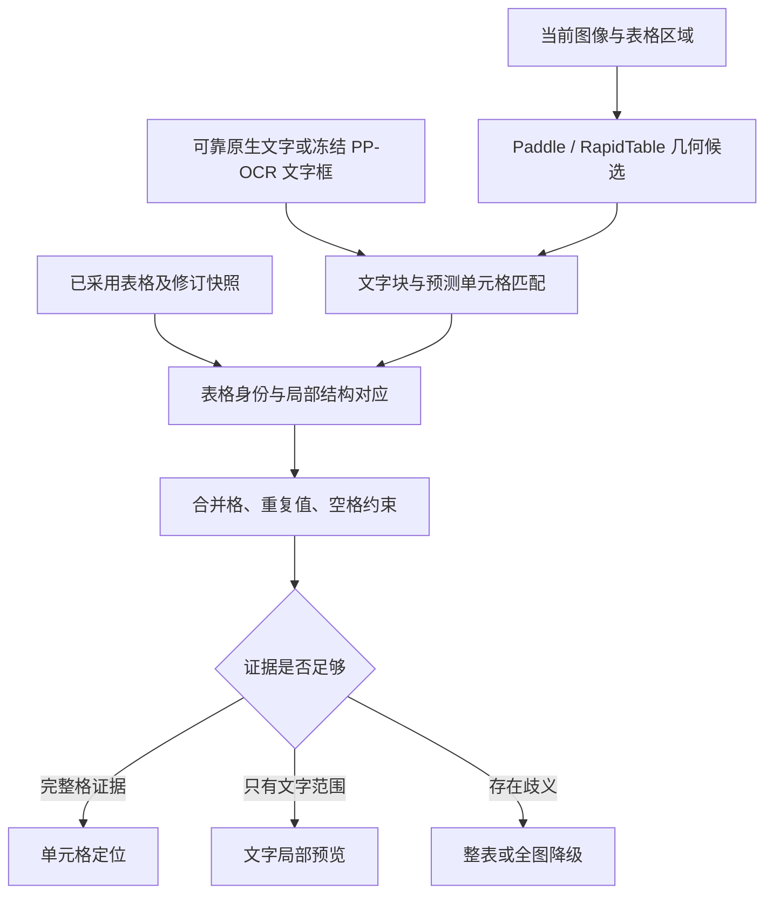

**DeloitteOCR：表格单元格局部匹配与真实几何开发计划**

制定日期：2026-09-13。源码基线：`42188b8123904555fea5d82a7f25f1e81a4257dc`，应用版本 `0.9.0rc1`，数据库 schema 9。

状态：已按推理前冻结的数据范围完成实现与实验交付，默认精确定位指标未达标。参见[实施记录](table-cell-matching-v2-status.md)、[质量报告](table-cell-matching-v2-quality.md)和[复现与许可](table-cell-matching-v2-reproduction.md)。以下保留原计划及验收口径；建议工期不等于实际工时，未覆盖输入类别不能视为已验收。

**1. 本轮要取得的结果**

让已采用表格中的单元格，在部分行列或合并关系与几何模型不一致时，仍能依据真实文字坐标、结构单元格和邻接关系，找到可解释的局部原图位置。匹配失败只影响不能证实的部分，避免整张表因一个结构差异全部降级。

实施主线：复用 Docling/TableFormer 的文字块—结构单元格匹配，再增加 DeloitteOCR 必需的“预测结构—已采用结构”局部对应适配。Paddle 继续提供主要几何候选，RapidTable 保留固定对照。先解决对应机制和坐标语义；是否需要新增 TableFormer 模型，由候选框可达到的覆盖上限和开发集实验决定。

本轮覆盖：文字块匹配、表格身份、局部对应、合并格、重复值、空格、失败诊断、数据隔离、评测，以及这些变化必需的缓存、校对定位和 PDF 导出兼容。

跨页表格合并、OCR 模型训练、第五路文字识别、自动修改采用文字、新办公格式和全面 UI 改版留到后续。几何仍不参与文字投票；原图、原始 OCR、采用结果和人工修改保持各自来源。

最终默认启用精确定位的原有目标保持：**精确覆盖率≥90%，错位率≤1%**。本计划同时建议增加“所提供定位的达标率≥95%”，避免错位率很低、框却普遍不准的情况。达不到就保留实验入口，并按失败类型明确下一轮投入方向。

**2. 已核实的起点与上游做法**

现有 100 表、5,819 格冻结测试的结果如下。这是固定参考文字和逻辑结构下的几何对应测试，不是完整应用的文字识别准确率。

| 路线 | 提供单元格定位 | 正确对应且完整格 IoU≥0.5 | 指向其他格 | 目标正确但框不达标 | 精确覆盖率 |
|---|---:|---:|---:|---:|---:|
| 当前 Paddle | 224 | 39 | 3 | 182 | 0.6702% |
| 当前 RapidTable 对照 | 379 | 178 | 1 | 200 | 3.0589% |

对原始映射记录重新汇总，Paddle 有 5,464 个目标标记为 `structure_or_table_identity_ambiguous`；另有 95 个目标所在推理项失败，没有映射。这个合并原因尚不能区分拓扑不一致、文字覆盖不足和多表歧义，必须先拆开诊断。

当前实现的三个限制：

- `conservative_mapping()` 要求整张表的行列及跨度拓扑完全一致、文字共享率达到阈值，才继续逐格匹配。
- 最终框须与唯一原始检测框达到 IoU≥0.95；这个数值用于证明检测来源，不是与人工标注比较的准确率标准。直接降低它会改变来源认定，不能当成算法改进。
- 目前一个 `polygon` 同时承担局部预览与完整单元格位置表达，不足以容纳文字范围、模型结构范围、派生范围等不同语义。

本轮进一步检查了以下官方源码，引用固定提交，避免开发期间上游漂移。

| 来源 | 已核实机制 | 本轮复用决定 |
|---|---|---|
| Docling `5ea6490ffdc57b2fd7de5cc436f2d0a22f2214d4` | 优先取表格区域内的词级文字块，缺少词级块时退回行/短语块；给每块独立 ID，统一缩放后调用 TableFormer matching，输出行列跨度 | 复用输入组织、坐标转换、文字来源与结构单元格分离的做法 |
| docling-ibm-models `d1569fdffee1d09cb3111d6d5490991cb59d59fd` | `CellMatcher._intersection_over_pdf_match()` 计算“相交面积 / 文字块面积”；代码将任何正相交加入候选，并非最终可靠性判定 | 复用候选构造和 OTSL/跨度解析；在项目适配层增加排他性、邻接和歧义判断 |
| 同提交 `MatchingPostProcessor` | 有列对齐、重复匹配处理、孤立文字处理；`_align_table_cells_to_pdf()` 会把结构框替换为所属文字块的包围范围 | 逐项评测后复用对应关系；始终另存模型原始结构框，不能把文字包围框冒充完整格边界 |
| 同提交 `TFPredictor` | `_compress_row_col_indexes()` 会根据剩余单元格重新编号，并调整跨度 | 保留重编号前后映射。不能直接把压缩后的行列编号当作已采用表格编号 |
| PaddleX `v3.7.0` | 结构预测、直接检测与补框/合框共同产生最终结果 | 保留所有阶段及父子关系，用明确的来源关联取代单纯根据最终框“像不像原始框”推断来源 |
| RapidTable `22592283c1f9d7c5a014c96c4ecc57de0b3ebfce`，当前对照 3.0.2 | 已有 SLANet+ 结构框、逻辑跨度及外部 OCR 输入 | 保留旧对照；增加接入同一新版对应器的对照，区分模型收益和匹配器收益 |

复用方式：首选适配 MIT 的 `tf_cell_matcher.py`、`otsl.py`、`settings.py` 及经验证需要的后处理函数，保留原文、提交号、许可证和修改差异。已核查匹配相关模块的直接依赖可与模型推理分开，现有 service 环境已有 NumPy；完整 `TFPredictor` 才涉及 Torch 模型推理。M0 验证实际导入链和 Windows 兼容性，不能仅凭源码进口列表宣称部署完成。

不直接照搬列删除、空列压缩、孤立文字强制归属等操作来修改工作台表格。它们只可生成候选结构及明确的转换记录。TableFormer 本身也不负责把任意人工修订结构对应到另一套结构，这部分是本项目必要的适配工作。

**3. 数据划分与防止测试集参与调参**

先完成划分和标注资格核验，再开始新算法实验。建议规模如下；M1 可根据合法可取得的完整标注调整数量，但必须在首次新算法推理前写入协议，并解释差异。

| 集合 | 建议规模 | 用途和限制 |
|---|---|---|
| 历史开发/回归集 | 原 100 表、5,819 格 | 已经分析过错误，转为开发材料；历史 manifest、模型输出和报告原样保留，后续回放写新目录 |
| 新增开发集 | 80 表，至少 4,000 格 | 补多级表头、局部行列差异、重复数字、空格、原生 PDF 和扫描文字块差异；可以反复诊断和调参 |
| 验证集 | 60 表，至少 3,000 格 | 用于选择预先登记的候选方案和策略阈值；不从这里复制个案规则后仍宣称独立验证 |
| 新封存测试集 | 120 表，至少 6,000 格 | 至少一百个独立原始文档，候选代码及策略锁定后运行；完整格坐标、文字、行列跨度齐全 |
| 页级定位补充集 | 60 页，开发/验证/测试各 20 页 | 包含多表、相似表、无表页；测试“先找到表格”的失败，不能用已有裁剪表测试冒充整页检测测试 |
| 中文/拍照检测补充集 | 使用合规公开数据单列 | 缺少文字/逻辑跨度时仅测 polygon 检测；既有 WTW 20 张已曝光，只作开发回归 |

合并格、重复值和空格标签可以重叠。新测试主集建议每类至少覆盖 25 张表、20 个原始文档；同时报告标签内全部格和真正具有该属性的目标格，避免把“有一个合并格的整张表”都当成合并格。目标为合并格≥300、重复值格≥500、空格≥200；不足则如实报告样本不足，不从其他集合搬图补成绩。

数据隔离规则：

1. 以原始文档分组，再合并同公司/同版式/同模板的高相似组。原页、裁剪、旋转、降质版本及同一表的不同渲染全部进入同一集合。页级补充集与裁剪集同样遵守此规则。
2. 排除历史图片和文档 ID，补充感知哈希、版面/文字特征近重复筛查，对临界匹配核对并记载。仅 SHA256 不足以排除换裁剪和换文件名的重复。
3. PubTables 使用官方完整单元格标注并核对 PDF→像素转换；FinTabNet 核验原始文档标识、跨度与坐标语义。无边框表遵循来源数据的完整格定义，不把文字紧框改称完整格。
4. 中文/拍照材料只有在具备完整坐标、转录和逻辑跨度标注时才进入逻辑匹配主集。新增标注工作另记成本和核验来源，不能拿模型输出作为正确答案。
5. 标注抽查覆盖每个数据源和每类关键属性；全部坐标异常、跨度冲突和转录歧义单列。确实不可判定的目标在推理前记录评测范围，不根据预测效果决定排除。
6. 推理输入清单与标注清单分离。推理器只读取图像、合法区域来源和冻结文字输入；评分器才读取目标框。测试集完整标注不进入开发错误分析脚本的默认路径。
7. 锁定来源 revision、图像/标注哈希、分组结果、样本资格、随机种子、坐标转换和划分协议。测试成绩出来后若继续按其错误调参，该版本测试集即成为已曝光集合，下一次独立结论需新测试集。

这里的“独立”指独立于 DeloitteOCR 本轮开发和策略选择，不承诺公开数据从未参与上游模型预训练。数据、模型权重和代码许可分别记录；现有 WTW 非商业研究数据继续不随应用分发。

**4. 先把失败分清楚：诊断协议**

输出同时保留 `primary_failure_stage` 和可多选的 `reason_codes`。主原因按确定的阶段顺序统计，合计必须能回到全部目标；辅助原因用于表达同一目标的多个问题，不能相加当作总失败数。

线上可以判断的是“为什么没有接受某候选”；与标注比较后才能判断“实际哪里错了”。两类字段分开，避免把匹配器自报原因当成真实因果。

| 用户关心的类别 | 需要细分的原因 | 评测中的证据 |
|---|---|---|
| 检测失败 | 整页未找到表；表内没有结构/检测候选；框无效；推理失败；候选框语义只是文字范围 | 整页用表格标注；表内用完整格候选最大 IoU 和一一匹配召回。裁剪模式不能统计整页检出率 |
| 结构不一致 | HTML/OTSL 损坏；框与逻辑槽不同步；表头多/少一行；局部行列插删；跨度冲突；空行列压缩；多表身份歧义 | 对照原始结构、后处理结构、采用结构，保留差异位置；不能统一记成一个 ambiguous |
| 文字锚点失败 | 无文字；OCR 漏字/错字；词/行粒度不足；重复值无法区分；空格无文字；来源版本不一致 | 保存候选 token ID、规范化前后文字、空间关系、候选分差和拒绝条件 |
| 框不准 | 目标对应正确但边界 IoU 不足；文字紧框被误当完整格；坐标偏移/缩放错误；框跨格；错误派生范围 | 根据正确目标的独立标注计算；指向别格另记错位，不混成一般低 IoU |

推理异常、超时和无输出必须保留在分母中。对损坏结构允许使用能够独立证明的其他候选，必须记录使用了哪份替代证据；没有有效证据就降级。

M0 先做两个不改变预测结果的诊断：

- **候选框上限**：对每个目标，检查现有真实候选中是否存在 IoU≥0.5 的框，同时报告一一分配后的上限。这个使用标注的 oracle 仅供诊断，不进入生产匹配、不计为实际覆盖率。分别统计直接检测、结构预测、后处理框和文字范围。
- **逐关卡损失**：整表身份、拓扑、文字共享、逐格锚点、来源一致性分别记录原始通过/失败数量。执行只用于解释的移除单个关卡实验时，同时报告新增正确和新增错误，不能将它当作准备发布的策略。

若原始完整格候选上限低于 90%，只改对应器不可能达到最终目标。此时先处理框语义/坐标或开展 TableFormer 模型候选实验，不继续靠放宽匹配阈值追数字。

**5. 统一文字、结构和几何契约**

沿用 schema 9 的结果、请求快照和 `geometry_evidence`，先在 JSON details 中增加版本化契约。除非实现发现索引或一致性确实需要，否则本轮不要求再做一次数据库迁移。

| 对象 | 必须具备的信息 |
|---|---|
| `TextToken` | 唯一 ID、来源结果/引擎、图像版本、原始文字、匹配用文字、真实 polygon、词/行/字符粒度、原生/扫描来源 |
| `PredictedCell` | provider、模型版本、原始 cell ID、原始行列区间和跨度、重编号映射、结构/检测 polygon、派生链 |
| `AdoptedCell` | 采用结果及修订、表格快照标识、行列跨度、原始文本、匹配用文本；不因定位改变表格内容 |
| `TokenAssignment` | token 与预测 cell 的候选/采用关系、相交占比、排他关系、冲突标记、来源独立性 |
| `CellCorrespondence` | 采用 cell 与预测 cell 或连续 cell 组的关系；一对一/一对多/多对一；锚点、局部行列约束、候选分差和拒绝原因 |
| `GeometryEvidenceV2` | 文字范围、完整格候选范围、实际显示范围各自字段；来源类型、推导过程、算法/策略/输入哈希、能力等级 |

坐标统一到当前图像版本的左上角像素坐标。保留原始坐标和转换矩阵；行列用明确的起止区间，结束位置采用 exclusive 约定。适配器处理上游格式差异，不能靠猜测数组长度或编号含义解析跨度。

明确区分三种几何：

- `content_polygon(s)`：真实文字块或其集合范围，适合核对文字；不等于完整格。
- `cell_polygon(s)`：真实检测、结构预测或有记录的几何推导所得完整格候选；依据各自来源和验证结果决定是否可接受。
- `display_polygon`：当前 UI 选用的范围。为便于观察添加的边距只影响显示，不能反写到几何证据或评测。

`geometry_origin` 至少区分 `direct_detection`、`structure_prediction`、`derived_from_cells`、`text_extent`、`manual`。结构模型产生的真实预测不必伪装成直接检测才能被评测；是否可发布由同口径误差验证决定。模型来源、匹配分数都不直接解释为正确概率。

兼容返回仍可保留 `level=cell/region/image`；另外增加范围语义和用途能力。仅文字范围不得升级为 `level=cell` 的完整格证据。对旧证据缺少的新字段，按 legacy 契约读取并保留原始含义。

缓存分两层：模型候选缓存绑定图像、区域、模型和原始文字输入；对应结果缓存再绑定采用结构、参与匹配的文本快照、算法和策略。更换算法或阈值不得复用旧对应结果。当前只检查结构指纹和固定来源名的命中逻辑必须同步调整。

本轮的“局部对应”指两份结构之间只接受可证明的部分，不扩大为“编辑结构后继续套用旧框”。结构编辑仍使相关历史对应失效。已经建立的单元格位置可在稳定身份下随文字修订保留，但旧文字锚点必须标注来自哪次快照；异步任务不得把旧文本的匹配决策当作当前修订的新验证。

**6. 对应算法的实施顺序**

**6.1 先确认是哪一张表，不要求整表拓扑相等**

优先使用同版本、具有真实坐标的已有表格区域。没有区域时调用现有版面组件。用区域内 token、非重复表头/内容锚点和页面空间关系建立表格候选。

相似表可以保留多个候选，必须满足唯一性和候选分差条件才确定身份。一个预测表不能未经解释分配给多个采用表。表格总行列数和整体文字相似度作为证据及检索特征，不再作为所有逐格定位的前置硬门槛。

**6.2 复用 TableFormer 的 token—cell 匹配**

使用文字块相交占比 `area(token ∩ cell) / area(token)` 建立候选，同时考虑文字中心、基线、与多个候选的相交差异、相邻文字的行序。这样能处理“文字只占大单元格很小面积”的情况，避免误用 token 与完整格的 IoU 判断归属。

上游“有正相交就加入候选”的结果必须经过本地排他判定。一个格可对应多个词；一个词跨越多个格时必须保留歧义。不能因为遍历顺序或最近中心就强行分配。

原生词级坐标直接使用。扫描 OCR 只有整行框时，优先利用引擎真实提供的更细块；不存在细框就保留行级证据。不能均分文字串来制造字符/词坐标。首轮主对照保持 OCR 输入冻结；如后续试验已有 PP-OCR 的局部补识别，应另建输入增强实验，单列新增耗时和收益。

保留上游匹配前结构框和匹配后文字范围。复用对齐、去重等后处理时逐个开关评测；孤立文字不能在无可靠证据时被强制塞入单元格。

**6.3 再对应到已采用表格，允许局部成功**

先用独立、稀有且一致的文字锚点建立行列关系，再按锚点之间的连续区间做局部序列对应，允许插行、漏行、额外表头等 gap。使用顺序约束和跨度相容性，避免一个偏移传播到全表。

优先利用成熟的序列对应/分配工具和上游已有结构解析。项目适配只实现采用结构与预测结构之间的约束，不再实现一套 OCR 或表格检测器。若采用二分图分配库，必须额外验证行列顺序；普通 Hungarian 分配本身不保证单调顺序或合并格约束。

候选得分拆为文字、空间、邻接、跨度及歧义几项并可解释。先执行越界、重复占用、顺序矛盾和来源版本等硬约束，再由开发/验证集选择接受策略。拒绝条件和候选分差写入证据，避免一个总分掩盖相互冲突的信号。

规范化只生成匹配用副本。保留金额的负号、小数点、币种、百分号和编号前导零；不把 `O/0`、`I/1` 或不同数字串直接视为相等。数字近似只能扩大候选，不能单凭近似通过接受门槛；人工修改文字不因匹配被还原成 OCR 值。

**6.4 合并格与局部结构差异**

| 情形 | 处理方式 |
|---|---|
| 两侧跨度一致 | 一对一对应，检查完整格与所属 token 的空间一致性 |
| 采用结果为一个合并格，预测为几个格 | 仅枚举连续、无洞、无其他已占用目标冲突的候选组；结合跨度和锚点对应，保留成员真实几何及派生关系 |
| 采用结果为几个格，预测只有一个合并格 | 不把同一个大框重复宣称为多个精确格；若有独立真实子格几何再分别对应，否则只显示文字范围或整组区域 |
| 局部表头跨度错误 | 隔离不一致区间，保留正文中独立成立的对应；不要求接受错误表头才能定位正文 |
| 框集合不连续或需要凭空补边界 | 不生成完整格定位，保留候选及降级原因 |

不能用平均行高/列宽补造空格边界。候选组合设置明确的数量、连续范围和运行时间预算，在开发集冻结；超过预算退回局部/整表提示，避免指数级枚举。

**6.5 重复值与空格**

`0`、`—`、相同金额和同名项目保留各自 token ID，不能按文字去重成一份。结合已独立确认的行标题、列标题、邻接内容、局部顺序和空间位置消歧；不以绝对行号或最近距离单独定案。传播的锚点记录依赖关系，同一来源推导出的多个锚点不能被当成独立佐证。

空格没有文字证据，只能依靠真实结构几何、局部行列位置和排他约束定位。全零矩阵、空白矩阵及高度对称表格若没有额外锚点，正确行为是保留歧义。出现多个等价方案时不能为了覆盖率任意选择。

**7. 对照实验与消融设计**

先在同一冻结 OCR 输入和同一采用结构下比较；各方法独立输出，不把多个方法的同源预测当作多票提高“置信度”。

| 实验 | 几何提供者 | 对应器 | 要回答的问题 |
|---|---|---|---|
| B0 | 原整表区域 | 无逐格对应 | 保留产品原始降级基线 |
| B1 | 固定 Paddle | 当前 legacy | 新旧同数据比较，保留旧错误 |
| B2 | 固定 RapidTable | 当前 legacy 对照 | 保留既有参照，不能悄悄替换旧算法 |
| N1 | 同份 Paddle 原始候选 | token 匹配＋局部对应 | 不换模型能提高多少正确覆盖 |
| N2 | 同份 RapidTable 候选 | 同一新版对应器 | 区分提供者能力和匹配器能力 |
| N3 | TableFormer 原始/匹配后候选，条件实验 | 对应器不变 | 现有候选上限不足时，新增模型是否有实际收益 |

N3 首先在开发集固定小批样本运行，锁定模型卡、权重、依赖、设备及模型配置。只有机制收益和运行成本明确后才考虑完整评测或产品集成；它仍是结构/几何组件，不增加文字识别票。

对 N1/N2 做逐项消融：只换 token 匹配、加入局部对应、加入合并格、加入重复/空格约束，以及移除各项后的变化。原始输出可重放时不重复 GPU 推理；每项报告新增正确定位、失去的正确定位、新增错位、框不准和耗时。只有阈值变化的实验单列，不能混写成局部算法收益。

数据运行分三条口径：

- **控制变量主轨**：参考文字和逻辑结构固定，真实 PP-OCR 框作为输入；沿用历史完整格评价，衡量对应器本身。
- **真实结果轨**：冻结实际结构引擎输出及预先确定的采用规则，原生 PDF 与扫描输入分组。不得逐样本用标注挑选最优引擎。评分所需的“结果 cell 对应哪个参考目标”由独立结构/标注关联确定，不能先按待评测定位框找最近 GT，再宣布身份正确；无法对应的参考目标计缺失，额外生成的格单列并计入输出质量。
- **页级/检测补充轨**：单列表格检出和 WTW 等 polygon 检测结果，不能与逻辑单元格精确覆盖混合。

真实结果轨才能回答校对定位和 PDF 导出在实际流水线中的可用程度。控制变量轨使用了参考结构，不得宣称已经证明全部端到端效果。

**8. 评价指标与判定规则**

主轨令 N 为全部合格标注目标，A 为系统实际提供的单元格定位数，C 为正确目标且完整格 polygon IoU≥0.5 的数量，W 为指向其他目标的数量，B 为目标正确但框未达标的数量。失败目标、无框目标和降级目标仍计入 N；一个目标不能靠输出多个候选累计成功。

| 指标 | 定义 / 用途 |
|---|---|
| 精确覆盖率 | C/N；主要收益，维持≥90%的最终目标 |
| 错位率 | W/A；维持≤1%的最终目标，A=0 时为 null |
| 所提供定位达标率 | C/A；建议新增≥95%的发布条件；不能用低错位率隐藏大量 B |
| 框不准率 | B/A；另报告边界 IoU 分布、缩小/扩大/偏移类型 |
| 定位提供率 | A/N；与精确覆盖分开，防止多报框看似改善 |
| 降级率 | 文字范围、整表、全图及无输出分别计数 |
| 候选上限 | 在标注辅助的一一分配下，当前候选几何最多可覆盖多少目标；只作诊断 |
| 对应局部性 | 单处结构扰动后，不受影响区域的正确定位保留率；受影响区错位数 |
| 检测指标 | 表格检出与 cell 候选检出分别报告召回、精确率；使用真实多边形时计算 polygon IoU |
| 时间 | 冷进程/模型加载、检测、token 匹配、局部对应、落库、缓存读取、UI 响应分别报告中位数/P90/P95 |

主轨还保留历史“其他 GT 行列的 IoU 严格更高即错位”的规则以便复算旧结果，并额外标出并列归属、无任何明显交集和人工标注身份冲突。新身份审计指标不覆盖历史字段；不把无法区分的并列归属直接计成功。

真实结果轨中多出的格、重复定位同一 GT、无法建立目标身份的输出单列为额外/无效输出，进入严格输出质量的分母；不能从报告中删除。分别展示按格加权和按表平均，按文档/模板组 bootstrap 给出区间，避免把同表上千格当作上千份独立证据。

必须分组展示：PubTables/FinTabNet/其他来源、原生/扫描、合并/非合并、重复值/唯一值、空格/非空格、有线/无线、局部结构不一致、多表。各组列出格数、表数和独立文档数。样本不足的中文/拍照组不宣称逻辑匹配达标。

性能目标：保持既有缓存 UI P95≤300ms。新增纯对应阶段建议预算 P95≤200ms/表（≤250 格，在已记录开发机上），超过规模的样本单列；大表采用局部候选和可中断预算，超时有明确降级。该 200ms 是待验证预算，不是现有成绩。Paddle GPU 与 Rapid CPU 的时间分列，不声称同硬件速度胜负。

进入默认精确定位需要：冻结新测试集达到原有两项主指标和新增输出质量条件；真实结果轨同步达标或明确将默认适用范围限制在经过验证的输入类别；关键分组不存在被总体均值掩盖的系统错位。未达标不修改成功定义、删样本或改变分母。区间及样本不足必须随点估计报告。

不设真人计时作为本轮开发收口条件；当前任务是几何对应效果。已有自动化响应时间与未来真人效率结果继续分开记录。

**9. 代码改动清单与产品兼容**

下表保留原计划的代码落点；实际模块、完成情况与范围调整以实施记录为准。

| 文件/模块 | 改动内容 |
|---|---|
| `src/ocr_workbench/geometry.py` | 保留 legacy 可重放入口；接新版对应器；更新缓存、来源选择、快照校验与降级输出 |
| 新增 `geometry_contract.py` | token/cell/evidence 契约、坐标语义、范围类型、字段验证 |
| 新增 `table_matching.py` | 上游 token 匹配适配、采用结构局部对应、跨度及歧义约束 |
| 新增 `geometry_diagnostics.py` | 阶段诊断、原因码、候选上限统计所需记录；线上代码不读取 GT |
| `table_geometry_worker.py` | 保存原始/派生框及 cell ID 关系，避免仅凭框 IoU 反推来源；记录分阶段时间 |
| `native_tables.py` | 接统一 token/cell 关系，保留原生词坐标和原始逻辑编号；预览采用机制继续有效 |
| `document_store.py` | JSON evidence 契约版本和哈希读取；必要的缓存查询适配，旧项目兼容 |
| `pdf_export.py` | 按范围语义检查完整格和文字证据；缺完整格时不得因有局部文字框绕过原预检 |
| `GeometryPanel.tsx`、`RegionPreview.tsx`、快速校对相关调用处 | 显示单元格/文字范围/整表的区别；展示简短失败解释；延续候选、上下文和人工绑定 |
| `scripts/evaluate_geometry_gpu.py` | 推理与映射重放拆开，读取冻结输入，验证运行锁后才复用结果 |
| `scripts/evaluate_rapid_reference.py` | 参数化数据/输出；保留 legacy 路线，新增公共对应器路线，记录 provider 差异 |
| 新增拆分/重放/诊断脚本 | 数据分组隔离、逐关卡分析、固定算法矩阵、盲测报告生成 |
| `config/geometry-evaluation.json` 及新增策略锁文件 | 明确新协议版本、指标、策略和默认适用范围，不改写旧报告 |

原有人工框选仍优先显示并保留来源。自动结果不得覆盖人工绑定。新增算法不能改变采用文字、表格编辑历史、复核状态或四引擎票数。仅提供文字范围的候选可以改善预览，但不作为完整格成功，也不能复制到多个格生成重复的 PDF 文字层。

对取消、崩溃恢复、修订冲突和图像版本切换沿用已有保护。任务输出提交前校验输入快照和当前有效身份；被取消或已失效的结果不得晚到落库为有效证据。

默认算法选择通过显式策略版本控制。保留 legacy 行为和原始候选用于诊断；策略回退只切换选择和清理对应缓存，不删除新旧证据。模型版本、算法版本和策略版本分别记录。

**10. 验证用例与实验可复现性**

新增测试围绕真实失败机制，避免只复制新算法的计算过程作为断言。

| 场景 | 必须验证的行为 |
|---|---|
| 额外表头/漏一行 | 不受影响正文仍可对应，偏移不传播成整列错位 |
| 合并表头下的普通格 | 合并格、普通格各自保留跨度和范围 |
| 一对多连续格 | 来源及成员明确，不能跨过不相关格合成区域 |
| 多对一大框 | 不能给每个子格复制相同精确框 |
| 两行相同金额、全零矩阵 | 有独立行列锚点时消歧；完全对称时降级 |
| 空列/空行、上游压缩编号 | 不丢逻辑槽，不把后续列错映射到前一列 |
| OCR 一行跨两格 | 不凭字符串长度均分出虚假词框 |
| 金额负号、前导零、百分比 | 不因规范化合并成另一数字值 |
| 大单元格内短词 | token 包含关系可成立，但文字紧框不冒充完整格 |
| 相邻同名表、多表页面 | 不跨表取锚点或复用同一预测表 |
| 旋转/裁剪/透视及去弯曲版本 | 坐标只用于正确版本，非线性变化后旧框不可用 |
| 框越界、OTSL/HTML 损坏、超时 | 失败原因可追踪，目标仍在评测分母 |
| 文字修改/结构修改/撤销 | 缓存和快照语义正确，不重新验证旧锚点或复活失效结构对应 |
| 人工绑定、异步取消、崩溃恢复 | 人工证据优先，晚到任务不能污染当前结果 |
| PDF 导出 | 缺完整格不被文字范围绕过；不新增重复文字层；结果与采用修订一致 |

合成样本用于坐标和不变量测试，真实冻结模型 artifact 用于机制回归，两者不代替新测试集准确率。补充顺序重排测试：改变字典/候选输入顺序不应改变唯一匹配；人工制造单处结构损坏，不应改变独立锚点区域的正确身份。

每次实验输出目录包含输入、模型、代码和策略指纹。`run-lock` 覆盖映射模块及传递依赖/上游适配代码，包含 provider、权重、OCR 快照、采用结构、坐标契约、种子、设备和线程数。现有“只要 evaluation.json 存在就跳过”的行为须改为先验证完整锁；任何条件变化生成新 run，不覆盖旧锁后继续复用旧输出。

失败分类计数、精确覆盖和输出质量应能由逐项 JSON 独立复算。冻结候选和策略后才运行新测试。评分缺文件、哈希不符或漏统计目标时整份报告标为不完整，不能用已有成功项算通过。

**11. 分阶段实施与决策点**

以下为单名熟悉项目的工程师估算，按有效工程人日计算，共约 17–25 人日。数据授权等待、额外人工标注和目标机取得时间不在估算内；若需正式接入 TableFormer 模型，再增加约 3–5 人日兼容和性能验证。效果研究可能得出当前候选不足的结论，工期不等于保证达到 90%。

| 阶段 | 预计 | 交付物 | 推进条件 |
|---|---:|---|---|
| M0 诊断与上游复用边界 | 2 日 | legacy 重放、四类失败细分、候选上限、上游源码/许可锁和边界说明 | 明确主要损失来自候选、坐标还是对应；不能继续用一个 ambiguous 解释全部失败 |
| M1 数据资格与划分 | 3–5 日 | 开发/验证/封存测试清单、完整标注检查、文档/模板排重和数据范围说明 | 新策略开发开始前完成冻结；无法取得完整标注的材料进入检测补充集 |
| M2 契约和 provider 适配 | 2–3 日 | token/cell/evidence v2；Paddle/Rapid 公共接口；原始框/文字范围分离 | 适配回放不丢原始证据，坐标和跨度测试通过；未引入静默重编号 |
| M3 token 与局部对应 | 3–5 日 | 复用 CellMatcher 的候选匹配、表身份、局部行列对应；N1/N2 首轮报告 | 能复现“不一致局部降级、独立区域保留”的改善；新增错位可定位，不靠阈值单项放宽获得结论 |
| M4 合并格、重复值、空格 | 3–4 日 | 一对多/多对一策略、锚点依赖、对称歧义处理、完整消融报告 | 开发集有可重复收益，验证集用于固定候选方案；风险组的错误类型清楚 |
| M5 工作台及缓存导出兼容 | 2–3 日 | 范围语义展示、快照和缓存锁、人工绑定及 PDF 预检兼容 | 针对性测试、现有相关回归、前端类型检查和构建通过 |
| M6 冻结评测与交付决定 | 2–3 日 | 新测试主轨/真实结果轨/检测补充报告、分组指标、性能、策略与回退说明 | 达标则给出适用范围明确的默认启用候选；未达标则交付实验功能和下一步因果证据 |

M0 可先利用旧 100 表完成定位问题诊断；M1 与上游导入兼容验证可以交错进行。M3 之前必须冻结新数据分组，M6 之前必须冻结代码、策略和真实结果轨的采用规则。

阶段决策按证据执行：候选框上限不足时转入框语义修正或 N3；候选足够而 token 归属弱时优先处理文字粒度；token 归属可靠但采用结构对应弱时继续局部结构适配；验证集覆盖上升但错位恶化时拒绝该策略。没有支持性证据不同时扩大模型、数据和阈值，避免无法判断收益来源。

**12. 最终交付清单与完成定义**

应交付：上游复用清单和许可；冻结数据划分与资格报告；版本化 provider/对应器代码；legacy 与 N1/N2 对照；必要时的 N3 报告；四类失败和逐关卡统计；分组覆盖/错位/框质量及区间；性能和资源记录；相关自动化回归；实验/默认范围、缓存失效与回退说明。

三种状态分别写清楚：

- **实现完成**：算法、数据契约、诊断、缓存及工作台兼容已经实现，相关工程检查通过。
- **实验有效**：开发/验证和冻结实验确实显示部分能力改善，同时保留全部失败及边界。
- **效果达标**：新封存测试的指定指标和适用范围满足要求；不能用实现完成替代这一结论。

优先完成 M0 的失败拆分与候选上限、M1 的数据隔离，再实施两段匹配。这样即使第一轮没有达到默认发布指标，也能明确知道下一轮应该换候选提供者、改善文字粒度，还是继续处理局部结构对应。

**引用与核对入口**

- [当前质量报告](C:/Users/A/Desktop/OCR/docs/document-workflow-quality.md)
- [当前对应代码](C:/Users/A/Desktop/OCR/src/ocr_workbench/geometry.py:25)
- [当前几何评测协议](C:/Users/A/Desktop/OCR/config/geometry-evaluation.json)
- [当前 RapidTable 对照脚本](C:/Users/A/Desktop/OCR/scripts/evaluate_rapid_reference.py)
- [Docling 表格模型：词级输入与 matching](https://github.com/docling-project/docling/blob/5ea6490ffdc57b2fd7de5cc436f2d0a22f2214d4/docling/models/stages/table_structure/table_structure_model.py#L235)
- [TableFormer：文字块相交匹配](https://github.com/docling-project/docling-ibm-models/blob/d1569fdffee1d09cb3111d6d5490991cb59d59fd/docling_ibm_models/tableformer/data_management/tf_cell_matcher.py#L465)
- [TableFormer：后处理文字范围](https://github.com/docling-project/docling-ibm-models/blob/d1569fdffee1d09cb3111d6d5490991cb59d59fd/docling_ibm_models/tableformer/data_management/matching_post_processor.py#L470)
- [TableFormer：行列编号压缩](https://github.com/docling-project/docling-ibm-models/blob/d1569fdffee1d09cb3111d6d5490991cb59d59fd/docling_ibm_models/tableformer/data_management/tf_predictor.py#L468)
- [PaddleX 表格子管线](https://github.com/PaddlePaddle/PaddleX/blob/v3.7.0/paddlex/inference/pipelines/table_recognition/pipeline_v2.py)
- [RapidTable 固定源码](https://github.com/RapidAI/RapidTable/blob/22592283c1f9d7c5a014c96c4ecc57de0b3ebfce/rapid_table/main.py)
