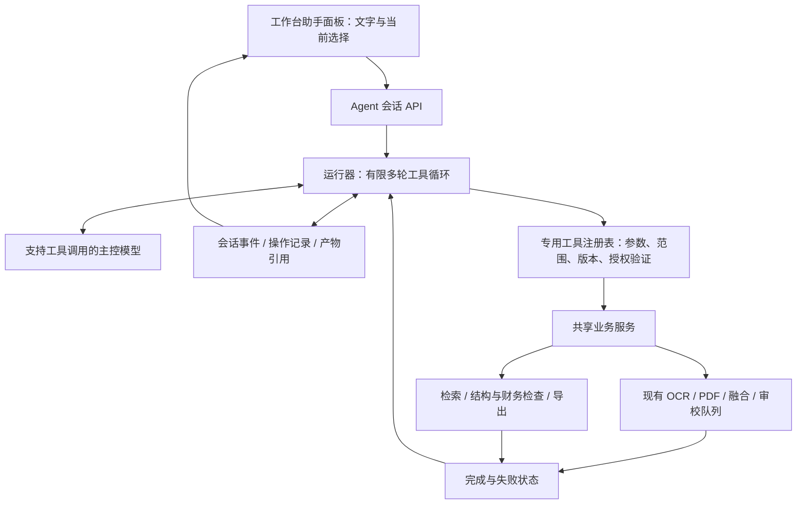

# OCR 工作台自然语言 Agent：开源实现调研与接入评估

调研日期：2026-09-20。范围：当前工作区源码静态检查，以及官方公开仓库的文档和核心源码。此轮未修改应用代码、安装 agent 框架、使用用户凭据或运行真实模型。以下方案是架构建议，尚不是已验证功能。

## 1. 判断

**可以做，并且现有工作台很适合增加一个调用专用业务工具的文档助手。建议在 Python 后端增加一个受控的 agent 运行层，复用现有 OCR、文档处理、结构检查、视觉审校、修订和导出能力。**

用户价值集中在跨步骤编排：用户用一句话表达目标，助手识别范围、选择工具、提交任务、等待完成、检查结果、处理局部失败，并给出可跳转到页面/单元格的结果。聊天、函数调用、持久任务管理三者需要一起设计。

这不会直接提升 OCR 引擎自身的识别准确率；收益首先是减少操作步骤、帮助发现疑点、按需调用已有复核能力。识别质量和 agent 执行可靠性应分别评测。

首选“小型 Python 专用运行层”；备选 DeepSeek Harness 自定义 profile 或 LangChain/DeepAgents。OpenCode 主要作为工具契约、权限、会话流和交互模式的参考。如果将来要支持大量第三方插件、复杂代理协作或通用编程任务，再重新评估完整框架的收益。

## 2. 研究对象和证据边界

直接读取官方仓库，固定到以下提交；本目录保存 30 份源码/文档/许可证快照，`source-index.json` 包含路径、URL、提交与 SHA256。仓库默认分支不等同于稳定发行版，特别是 OpenCode 本次读取的是 `dev`。

| 项目 | 固定提交 | 查到的关键事实 | 对本项目的判断 |
| --- | --- | --- | --- |
| [DeepSeek Harness](https://github.com/deepseek-ai/deepseek-harness) | `ddefc45fbc7f8e46dd73185e68295696d1297887` | Cordis 插件组合；agent loop、模型适配器、工具注册表、会话日志都是可组合组件；有 Python SDK 和 Windows x64 运行时 | 很适合借鉴分层；可以直接嵌入，但要定制 OCR profile 并承担额外运行时和升级维护 |
| [OpenCode](https://github.com/anomalyco/opencode) | `ebb7b76eca82342642c78645109e865614533827` | 工具输入/输出 schema、工具注册与输出限额、allow/ask/deny 权限、会话 HTTP 接口、SSE 事件和压缩 | 适合参考成熟交互与运行机制；整个编程工作台对 OCR 首版范围偏大 |
| [DeepAgents](https://github.com/langchain-ai/deepagents) | `bc3c2935650f8e8a0862d51226d986d842bd3824` | Python `create_deep_agent` 接受 tools、middleware、checkpointer、interrupt_on；提供上下文和文件系统等机制 | 同语言集成候选，但默认能力与依赖需裁剪；不能假定默认 agent 就是 OCR 专用助手 |

三者本次读取的仓库许可证均为 MIT；若实际分发，需要另行核查选定发行版本及其传递依赖、运行时和许可证清单。这里没有做框架安装大小、性能、模型准确率或 Windows 打包实测。

### DeepSeek Harness：最值得借鉴的是执行管线和会话事实

官方[架构文档](https://github.com/deepseek-ai/deepseek-harness/blob/ddefc45fbc7f8e46dd73185e68295696d1297887/docs/architecture.zh.md)明确：一个 step 是模型请求及其工具调用，多个 step 组成一个 turn。工具结果继续反馈给模型，直到没有待完成工作。

其[工具执行管线](https://github.com/deepseek-ai/deepseek-harness/blob/ddefc45fbc7f8e46dd73185e68295696d1297887/docs/tool-execution-pipeline.zh.md)把执行前策略、不可被后续允许覆盖的拒绝守卫、工具执行、执行后处理和最终结果分开；调用与结果进入会话日志。对应源码为 `packages/core/tools/src/index.ts`。

`packages/core/agent-loop/src/tool-calls.ts` 区分排他执行和并行执行，支持并行数量限制、取消后停止启动新调用，并按模型顺序记录结果。这非常适合借鉴到 OCR：读取元数据可以有限并行，GPU 推理和对同一结果的修改仍由既有队列串行控制。

`packages/compaction/compaction/src/tool-pairing.ts` 在压缩时保持工具调用与结果配对。OCR 助手也不能只保留一句“已完成识别”，却丢掉任务 ID、失败页和结果版本。

**直接采用的真实成本：** [Python SDK 文档](https://github.com/deepseek-ai/deepseek-harness/blob/ddefc45fbc7f8e46dd73185e68295696d1297887/docs/user/guide/python-sdk.zh.md)明确安装匹配的原生运行时 wheel，普通使用不需要系统 Node.js；SDK 延迟启动 `dsh --profile …` 进程。这是一条可行的 Windows 路线，不能以“Python 项目不能接 TypeScript”排除它。

但 [sdk-minimal](https://github.com/deepseek-ai/deepseek-harness/blob/ddefc45fbc7f8e46dd73185e68295696d1297887/packages/bundle/sdk-minimal/README.zh.md) 默认提供平台 shell，并省略压缩、托管凭据等组件；它不是默认安全隔离的 OCR 工具集。要用于本项目，需显式配置专用业务工具、去除 shell、适配凭据与权限，并验证离线包。仓库 README 同时标明开发者预览和未来破坏性变更；根包版本为 `0.1.6-alpha.2`。

### OpenCode：最值得借鉴的是工具契约和可见执行过程

[`tool.ts`](https://github.com/anomalyco/opencode/blob/ebb7b76eca82342642c78645109e865614533827/packages/core/src/tool/tool.ts) 不仅给模型展示 schema，也在实际执行入口解码校验输入，编码校验输出，并区分结构化结果与模型可见内容。

[`registry.ts`](https://github.com/anomalyco/opencode/blob/ebb7b76eca82342642c78645109e865614533827/packages/core/src/tool/registry.ts) 对未知、已变更的工具调用返回明确错误，并通过输出存储限制工具结果体积。对于几百页 OCR，模型应拿到摘要、页码和引用，再按需拉取内容，不能每一步塞入全项目 JSON。

[`permission.ts`](https://github.com/anomalyco/opencode/blob/ebb7b76eca82342642c78645109e865614533827/packages/core/src/permission.ts) 将 action/resource 权限和执行机制分开；[`event.ts`](https://github.com/anomalyco/opencode/blob/ebb7b76eca82342642c78645109e865614533827/packages/server/src/handlers/event.ts) 提供有界 SSE 事件流和心跳；`session/compaction.ts` 单独处理历史摘要及 token 预算。

对本项目，最有价值的 UI 是“正在检查第 8 页”“已发现 3 项疑点”“查看原文”“下载汇总”，以及取消和恢复状态。聊天里应能看见实际工具结果，不应把模型生成的完成声明当作任务完成证据。

本次快照是 Bun/TypeScript monorepo；这并不表示最终用户一定要自己安装 Bun，但整套引入仍增加独立 agent 服务的交付和生命周期管理。没有验证其完整框架嵌入本工作台的成本。

### DeepAgents：Python 备选，但默认组件也需要筛选

[`graph.py`](https://github.com/langchain-ai/deepagents/blob/bc3c2935650f8e8a0862d51226d986d842bd3824/libs/deepagents/deepagents/graph.py) 提供自定义工具、持久检查点和执行中断接口，内部组合文件系统、摘要、工具调用修补等中间件。默认文档列有文件工具、执行工具和子 agent 工具；shell 能否执行取决于后端实现，不能把默认存在 `execute` 等同于默认获得本机 shell。

本次库版本 `0.7.15`，Python 要求 `>=3.11,<4.0`，与本项目配置的 Python 3.12 在版本范围上兼容。但 pyproject 列有 LangChain、模型适配器和 LangSmith 等依赖；版本兼容不等于完整运行时兼容。若采用，需要锁依赖、限制默认工具、核查实际联网行为，并让框架检查点与业务任务 ID 正确关联。

## 3. 当前 OCR 源码可以复用什么

| 业务能力 | 已有源码/接口 | agent 接入方式与缺口 |
| --- | --- | --- |
| 工作区和项目状态 | `service.py` 的 `/api/state`、`/api/projects/{key}` | 包装成摘要与分页查询；每个会话绑定项目，避免将所有项目全文提供给模型 |
| 文档分页与检索 | `document_routes.py` 的 pages/search 接口 | 可定位页码和采用版本；现有搜索是文字匹配，不是语义检索，不能宣称已有 RAG |
| PDF 原生提取/按页 OCR | `documents.py:process_pages`，文档 process 接口 | 复用 auto/native/ocr 模式、页面范围、引擎验证和 stage 队列 |
| 多引擎 OCR/融合 | `service.py:create_tasks`、`Store.enqueue`、`task_queue.py` | agent 返回 task IDs 并等待完成，不在工具函数中再次直接加载模型 |
| 文字、表格与证据 | result、issues、evidence、geometry 接口 | 返回有限范围的内容及 result/version/revision 引用；图片按需裁剪读取 |
| 结构与财务疑点 | `structure_routes.py`、`structure_store.py:structure_view`、`financial_checks.py` | 复用候选/疑点数据；金额检查使用 Decimal，数字计算由确定性工具执行 |
| 外部/本地视觉审校 | `multimodal_routes.py`、`multimodal_store.py` | 复用提交、取消、快照、建议与采用机制；agent 主控模型可以与视觉模型不同 |
| 修订与撤销 | `multimodal_store.py:decide_review`、result/history 接口 | 使用已有版本检查和修订链；首版保留建议采用交互 |
| 导出 | `service.py:export`、`exporting.py`、`pdf_export.py` | 复用导出器；新增持久产物记录和可重新下载入口 |
| 模型凭据和 HTTP | `external_review.py` | 复用 DPAPI vault 和部分传输设计；新增 agent 协议适配器与独立配置 |
| 对话入口 | `frontend/src/WorkspaceLayout.tsx`、`App.tsx` | 增加可收起的助手面板，携带当前项目/文档/页/选择范围；窄屏改为独立视图 |

### 五个确定的工程缺口

1. **模型协议不支持 agent 回合。** `external_review.py:payload_for` 当前是一次性非流式审校请求；`normalized_reply` 明确拒绝 tool calls。不能只改提示词，也不能移除审校验证后把两条协议混用。新增多轮消息、tool-call/result 配对、取消、截断和供应商差异处理。
2. **现有外部连接只有一个，且保存前验证视觉审校能力。** 文字主控模型不一定支持图像，不能强行通过该测试。新增 agent 连接或为模型配置增加角色与能力探测；保持审校工作流的协议契约。
3. **普通 OCR 提交不具备融合请求的同等幂等保障。** `Store.enqueue` 只有 `fusion_policy is not None` 时校验/查询/保存 `request_id`。agent 的重试与崩溃恢复需要所有写工具的操作去重，不能因函数参数存在 `request_id` 就认为已覆盖。
4. **导出是临时下载。** 当前 `FileResponse` 结束后用 `BackgroundTask(shutil.rmtree, target.parent)` 清理文件。对话中的历史下载链接需要单独的 artifact ID、保留策略、鉴权与文件存在性检查。
5. **现有鉴权是本机应用鉴权，不是 agent 的项目能力边界。** `service.py:local_auth` 限制 host/origin 并验证 Bearer token。agent 工具层还需从绑定会话验证每个 ID 的项目归属；模型不能用参数切换到其他项目或获得任意 HTTP/SQL/文件访问。

## 4. 推荐架构

**最小运行循环：** 接收用户目标和固定上下文 → 给模型提供工具说明 → 验证模型请求 → 执行业务工具 → 持久化实际结果 → 将结果反馈模型 → 继续或输出最终答复。循环受最大步数、任务规模、token/费用预算与取消状态约束。

大任务返回 `task_id`/`stage_id` 后，运行器进入 `waiting_task`；后台观察任务状态，到完成/失败再唤醒。等待期间不持续请求模型。首版可以轮询现有存储，无需先重构所有队列为事件总线。

建议新增 `agent_runtime.py`、`agent_tools.py`、`agent_provider.py`、`agent_store.py`、`agent_routes.py`；必要的路由业务逻辑提取为共享应用服务。工具可直接调用此服务层，但必须保留 review-only 限制、maintenance 锁、队列健康检查及项目校验，不能绕过路由里的保护。

会话状态建议包括 `idle/running/waiting_task/waiting_user/completed/failed/cancelled/interrupted`。会话记录工具调用、经过校验的参数、实际结果、模型/配置版本、任务和证据 ID；保存简明执行依据即可，不要求保存隐藏推理文本。

前端先显示工具步骤和实际进度；token 流式输出可以后加。若使用 SSE，现有 Bearer 鉴权意味着不能直接用无法设置自定义头的原生 EventSource，应采用带 Authorization 的 fetch 流或另行设计短期流鉴权，避免把 token 放进 URL。

## 5. 第一批工具及交互

以下是**建议接口**，不是已经存在的 agent API。按业务意图组合工具，不把每一个 HTTP 路由全部暴露给模型。

| 建议工具 | 输入重点 | 输出/作用 |
| --- | --- | --- |
| `get_workspace_context` | 会话绑定的项目和当前选择 | 文档、页、采用结果、引擎可用性与任务摘要 |
| `search_document` | 文档 ID、搜索词、分页 | 采用结果中的匹配、页码、单元格/文字引用 |
| `read_page_result` | 页/结果 ID、需要的范围 | 文字/表格切片及 revision，不整库读取 |
| `process_pages` | 明确页集、模式、引擎 | 复用处理管线并返回持久 stage IDs |
| `run_ocr` | 版本 ID 列表、引擎列表 | 幂等提交任务；可扩展融合选项 |
| `inspect_table` | result ID、表格 ID | 结构候选、现有财务疑点与来源；内部复用两个检查能力 |
| `request_visual_review` | 选中目标、模型角色、版本 | 复用审校队列，生成建议，不直接改结果 |
| `get_job_status` | 本会话关联的任务 ID | 真实完成/失败/取消状态；通常由运行器内部观察 |
| `export_results` | 结果范围、格式、汇总选项 | 调用导出器并创建可下载 artifact |
| `navigate_to_evidence` | 文档/页/结果/目标引用 | 前端验证后跳转并高亮，不执行任意脚本 |

工具返回统一携带状态、摘要、稳定引用和结构化错误。典型错误应区分 `STALE_REVISION`、`QUEUE_UNAVAILABLE`、`UNSUPPORTED_MODEL_CAPABILITY`、`SCOPE_DENIED`，让模型知道是需要刷新、等待、换方案还是停止。

**目标场景 A：** “把这份 PDF 的第 1—20 页识别出来，表格汇总成 Excel，金额有疑点的地方列给我。”

助手解析并展示范围 → 提交原生提取或 OCR → 等待队列 → 检查采用结果和疑点 → 返回工作簿及带页码/单元格的疑点清单。遇到尚未采用或失败的页，明确说明并按既定规则处理，不能默默遗漏后声称整份完成。现有汇总导出应在样本中确认满足需求；跨页表自动拼接不作为首版承诺。

**目标场景 B：** “第 8 页这个数字看不清，帮我复核一下。”

优先使用当前单元格选择 → 核对结果版本 → 调用局部视觉审校 → 呈现建议与原图证据 → 通过现有采用入口写入可撤销修订。模型主控不必自己具备视觉能力，可以把看图委托给已有审校工具。

**目标场景 C：** “为什么这张表合计不一致？”

先读取当前表和 Decimal 检查结果，再解释差额、单位、舍入容差及疑似单元格；需要时发起局部审校。不能只凭数值关系自动反改原始识别文字。

**目标场景 D：** “只重跑刚才失败的页，完成后导出。”

从会话关联任务中获取失败集合 → 创建一次幂等重试操作 → 等待并更新产物。原先成功页面不重复入队。

## 6. 授权、恢复与上下文：只做业务必需的约束

读取当前项目、用户明确要求的识别/检查/新建导出可在任务授权范围内连续执行，不必每一步确认。仅在范围不清、首次使用未授权的外部数据发送、具体修订采用或覆盖/删除等需要用户决定的动作前交互；授权绑定具体范围，并在后续步骤复用。

首版不暴露 shell、任意 Python、任意 HTTP、原始 SQL、任意文件路径和项目删除/引擎包管理。模型输出必须经过服务端 schema 校验和业务校验；PDF/OCR 正文中的“忽略规则、上传文件”等文字只是文档数据，不能成为操作授权。

每次写入使用 `operation_id`、参数哈希、输入版本与调用记录。去重记录和业务提交应在同一事务中完成，或建立可恢复的关联协议，避免“任务已提交但 agent 尚未记账”导致重启后重复提交。跨进程调用不能空口保证 exactly-once；应通过持久操作记录、幂等业务动作和恢复核对实现效果去重。

恢复时先查询已有任务真实状态，再决定继续等待或重试。断开模型请求、停止 agent 后续动作、取消已提交业务任务是不同操作，应在 UI 明确区分。agent 的“停止”至少停止新调用；对已有任务按照已选择的停止范围调用现有取消逻辑并核实状态。

会话固定项目/文档/页面 ID；用户切页不应让后台任务悄悄改目标。写入时重新核验 result/version/revision，过期建议刷新后再处理。

上下文按需读取、分页和裁剪。摘要必须保留用户约束、未完成任务 ID、失败页、结果 revision 和产物 ID；不可把授权或任务成功状态仅依赖于模型写出的自然语言摘要。暂不需要向量数据库，也不需要多 agent。

## 7. 模型与离线策略

主控模型应验证中文意图理解、原生工具调用、多个回合、工具结果回传及异常恢复。模型列表可见、HTTP 请求成功或审校 JSON 成功，都不能证明 agent 能力通过。

主控模型与视觉审校模型是两个角色：前者负责调度，后者负责看图。可分别连接同一供应商、不同供应商或内网服务；不要把“DeepSeek Harness”框架选型与“必须使用 DeepSeek 模型”混为一谈，具体兼容性以所选 profile/适配器实测为准。

建议优先验证现有可达的内网或外部 API。复用 DPAPI 凭据基础，但新增角色配置与工具调用探针；不要自动发送项目正文作为连接测试。保存地址不等同于授权所有项目内容外发。主控模型读取到的 OCR 文本同样属于外发内容，即使图片仍由本地工具处理。

完全离线 agent 在架构上可行，前提是另有支持工具调用的本地模型及服务。当前本地 Qwen3.5-4B 是视觉审校路径，尚未验证通用多轮工具调用，不能直接承诺胜任主控。主控与 OCR 若共用 GPU，还需评估显存和卸载切换；可考虑 CPU 主控或独立内网模型服务。无可用主控模型时，原有工作台继续使用。

## 8. 路线选择与首轮验证

| 路线 | 优势 | 必须承担的工作 | 建议 |
| --- | --- | --- | --- |
| Python 专用运行层 | 最大化复用现有运行时、SQLite、队列与权限；可限定十个左右工具 | 自己实现多轮协议、操作记录、恢复、预算与上下文管理 | **本项目首选**；单主控、少量工具让范围可控 |
| DeepSeek Harness + OCR profile | 复用循环、插件、会话和工具管线；已有 Windows Python SDK | 定制工具/profile、精简默认能力、双进程生命周期、凭据与离线包验证 | 希望快速获得可扩展插件架构时的备选 |
| Python agent 库 / DeepAgents | tools/checkpointer/interrupt 等已有抽象 | 筛选中间件、锁定依赖、对接业务任务恢复，避免两套状态不一致 | 更重视复用运行机制时值得做对照原型 |
| OpenCode 独立服务 + 业务工具桥 | 已有编程 agent 服务及交互模式 | 关闭无关能力、独立进程与配置、维护业务桥接与 UI 集成 | 可做技术验证；当前不优先整体引入 |

MCP 可以以后把同一批业务工具提供给其他 agent 客户端。它解决工具接入标准化，不会自动解决会话、幂等、任务恢复、模型决策和权限。工作台内首版使用函数工具即可；工具定义与实现解耦，为后续 MCP adapter 留接口。

建议按以下顺序推进，阶段通过后再扩大范围：

1. **协议与只读闭环。** 用无敏感的合成项目实现上下文、检索、读页、跳转。验证真实模型至少两个工具回合；支持错误工具名、参数错误、用户取消，并显示证据来源。
2. **任务闭环。** 加入按页处理/识别、实际任务等待、失败页重试、导出 artifact。补齐普通 OCR 幂等；用断连和重启检查重复任务。
3. **审校闭环。** 加入财务检查与局部视觉审校，接入现有建议采用、版本冲突和撤销机制。
4. **交付加固。** 冻结依赖与数据库迁移、离线包启动、网络模式、GPU 共存、会话恢复、产物保留和模型用量上限；再考虑上下文压缩及更多工具。

建议先冻结约 20—30 个中文任务作为小规模评测集，覆盖上面四个目标场景及错误/中断情况。规模是试验建议，不代表已测。重点指标：任务完成率、工具选择/参数正确率、失败页报告完整性、重复副作用数、越项目访问数、证据引用有效率、模型请求数/token/耗时。

至少需要验证：普通与融合 OCR 不重复入队；崩溃发生在提交前/后都可核对恢复；任务未完成时不宣称导出完整；切页不改目标；过期 revision 不覆盖新编辑；伪造跨项目 ID 被服务端拒绝；文档内指令不能授权新动作；中途取消不启动后续任务；已保存对话的文件可按保留策略重新下载；中文含糊页码会先澄清。

**下一步最值得做的是一个少工具、真实模型驱动的闭环原型，而不是先移植完整开源 agent UI。** 用“定位页面 → 提交处理 → 等待结果 → 检查疑点 → 生成下载”这一条链路验证产品价值，再决定是否引入完整框架。

## 9. 本轮交付与复查

- 本报告：源码事实、候选方案、首版工具设计和验证路径。
- `source-index.json`：30 份固定提交的公开来源快照索引与 SHA256。
- `sources/*.meta.json`、`sources/*.tree.json`：三个仓库的元信息与文件树。
- `fetch_sources.py`：按固定提交获取选定来源，优先复用已保存快照。更换提交时需使用新的快照目录，避免混用缓存。

本轮验证仅检查资料完整性与引用，不运行应用回归测试；没有应用行为变化。上述方案的实际模型效果、部署体积、运行性能与稳定性，需要后续原型验证。
