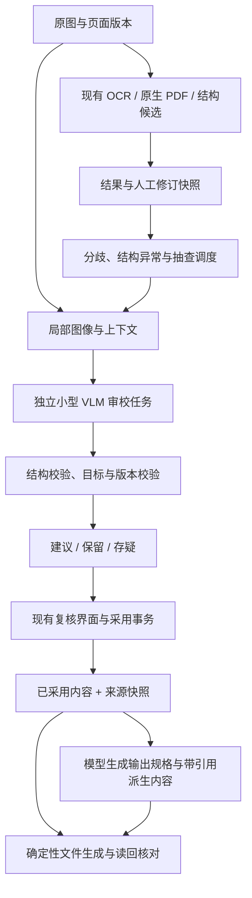

# 多模态二轮审校与智能输出：面向 DeloitteOCR 的探索调研

2026-09-17。依据当前工作区 0.10.0rc3 源码、项目既有质量报告，以及本次实时取得的官方模型卡、GitHub 源码和研究资料。**结论：值得做，现有工程基础适配度很高；优先验证局部视觉审校和受约束的输出辅助。Qwen3.8 确实存在，但目前查到的官方最小版本为 27B，16GB 目标机应先比较 Qwen3.5-4B 与 Qwen3-VL-4B。**

本次完成资料与源码研究，没有运行新增模型，因而没有本项目的准确率提升、推理速度或峰值显存实测结论。所有预期收益、实验门槛和工期都是研究建议。取得的外部资料为公开文本，没有上传项目文档或用户图像，也没有下载大模型权重。

## 1. 当前项目已经具备什么，真正值得补什么

目前的系统已经有 PP-OCRv6、PaddleOCR-VL-1.6、GLM-OCR、HunyuanOCR-1.5。后三条属于多模态 OCR / 文档解析路线。新增 Qwen 的价值应通过三个具体问题衡量：它能否找出已有结果中的错误；能否在原图支持下提出正确修改；能否帮助用户把已经确认的内容组织成需要的文件。

现有 React/FastAPI/SQLite、独立模型进程、单 GPU 调度、图像版本、原始结果与人工修订分离、融合疑点、结构候选、撤销历史、来源导出，为二轮模型提供了很好的接入基础。当前也已支持 PDF/TIFF 文档工作流和可搜索 PDF；不能沿用旧调研中“尚无 PDF”的描述。现有常规输出为 TXT、Markdown、JSON、XLSX；DOCX 是可新增的方向。

需要正视的现有证据：

- [融合质量报告](../docs/fusion-quality-report.md)：积极手写策略曾修正 3 处、引入 2 处，并改坏原来正确样本。当前两档、三类别均关闭自动候选替换。200 张公开样本全部有历史曝光，没有独立留出或真人效率结论。
- [TableFormer 后续实验](../docs/tableformer-next-20260915-quality.md)：TableFormer raw + local-v3 实验中，固定 PaddleOCR-VL 实际采用结构的完整格定位覆盖为 69.71%（7,862/11,278 个独立参考格），合并格为 43.75%（154/352）。输入是表格裁剪；这不是当前 Paddle + local-v2 默认配置的成绩，也不是整页检测覆盖率或已提供框中的准确率。因此不能假定每个单元格都有可靠局部截图；只在有框的格上测试会高估全流程能力。
- [公开材料实验](../docs/public-quality-20260916.md)：页面处理完成、JSON 合法、导出读回一致，各自证明不同的工程属性，都不等于原图内容已正确识别。

**优先级判断：先做“有图像依据的修改建议”，其次做结构和输出辅助，最后才讨论自动采用。** 若二轮模型最终只能把句子写得更通顺，而金额、姓名、编号和结构更容易出错，就没有达到本项目的目标。

## 2. 小参数模型选择：澄清 Qwen3.8

本轮在 Hugging Face 官方 `Qwen` 作者范围检索 `Qwen3.8`，返回 27B、Flash-Next、2.4T-A95B 及相应 FP8 条目，未见 2B/4B/8B/9B 型号。这是本次检索范围内的结果，不代表未来不会发布小版本。官方仓库新闻列出 Qwen3.8-27B 于 2026-08-14 发布；HF 仓库创建日期不能当发布日期。

| 候选 | 事实与定位 | 对当前项目的判断 |
|---|---|---|
| [Qwen3.8-27B](https://huggingface.co/Qwen/Qwen3.8-27B) | 官方多模态 27B，Apache-2.0 | 可作未来大模型质量对照；不是本轮 16GB 首选 |
| [Qwen3.8-Flash-Next](https://huggingface.co/Qwen/Qwen3.8-Flash-Next) | 模型卡列 125B 主体、6B 激活，另有 51B n-gram 与 4B MTP；HF 总参数约 180B；Qwen 社区许可 | “激活 6B”不等于只需装载 6B 权重，不能按小模型估算部署 |
| [Qwen3.5-4B](https://huggingface.co/Qwen/Qwen3.5-4B) | 官方小型多模态模型，Apache-2.0 | **首轮主要候选**：视觉审校、字段关联、结构化建议与输出规格 |
| [Qwen3-VL-4B-Instruct](https://huggingface.co/Qwen/Qwen3-VL-4B-Instruct) | 官方视觉语言模型，Apache-2.0，有官方 GGUF | **首轮主要对照**：直接指令模式与局部视觉读取，便于独立验证 |
| [Qwen3.5-2B](https://huggingface.co/Qwen/Qwen3.5-2B) / [Qwen3-VL-2B-Instruct](https://huggingface.co/Qwen/Qwen3-VL-2B-Instruct) | 官方小型多模态候选 | 成本基线；适合测局部读取、简单分类和输出映射，不能预先假定复杂表格推理可靠 |
| [Qwen3.5-9B](https://huggingface.co/Qwen/Qwen3.5-9B) / [Qwen3-VL-8B-Instruct](https://huggingface.co/Qwen/Qwen3-VL-8B-Instruct) | 官方较大档多模态候选，Apache-2.0 | 4B 有净收益后再测质量上限与延迟代价 |
| 已有 GLM-OCR / PaddleOCR-VL / HunyuanOCR | 已集成的专用 OCR 多模态路线 | 必须作为“再识别一次”的成本/效果对照；专用 OCR 能看图不等于擅长任意审校指令 |

**硬件结论有明确边界。** 目标是 RTX A4000 16GB；本轮 `nvidia-smi` 读取到开发机 RTX 4070 Ti SUPER、16,376 MiB。两台卡显存同档，不代表性能相同。

本轮核查的一份 Unsloth Qwen3.8-27B `UD-Q4_K_M` 文件为 16,464,440,224 字节，加 F16 视觉投影文件 927,607,488 字节，合计约 **16.20 GiB**。仅文件权重就超 16 GiB，尚未计算缓存、视觉计算和运行时。因此不推荐这一量化组合全 GPU 驻留；CPU 卸载或更激进量化可以另测，但不能当作无代价解决方案。这个结论针对具体产物，不宣称所有 27B 量化都绝无可能运行。

按名义 4B 参数粗算，BF16 的纯参数量约 8GB 十进制，4-bit 理想值约 2GB；8B/9B 的 4-bit 理想值约 4/4.5GB。**这只是参数存储数量级，不是 GGUF 文件大小或实测显存**：量化元数据、非量化层、视觉部分、KV/状态缓存和工作区都要另算。以实际远端文件元数据为例，Qwen3-VL-4B 官方 Q4_K_M + F16 projector 合计 3.333GB，Qwen3.5-4B 的 Unsloth 同类组合为 3.413GB，Qwen3-VL-8B 官方组合为 6.187GB；这些仍只是磁盘文件大小。上线应按实际图像数量、分辨率、上下文和最大输出测试。不要把宣传的超长上下文作为本地默认值。

推理路线建议沿项目已有 `llama-server` 的本地回环、鉴权、进程释放和离线资源锁定模式。已核查项目现用 b10894 的源码存在相关 Qwen 架构，官方 release 有 Windows CUDA 资产；这只证明具备兼容基础，仍需图像输入、多图、JSON 输出、取消和 OOM 恢复实测。Transformers 可作参考路线，其上游文档中的 `main/latest` 安装方式应在实验后转成固定版本与离线依赖。Ollama 适合快速试验，但模型目录、守护进程和包体交付需要适配现有产品生命周期。

完整模型与运行时证据见 [model-findings](multimodal-review-20260917/models/model-findings.md)。

## 3. 二轮修正与校验：四种工作应分别设计

| 工作 | 模型输入 | 合理输出 | 首轮建议 |
|---|---|---|---|
| 文字保真复核 | 有实际来源的局部图、邻近行、原始 OCR 候选 | 保留 / 修改建议 / 无法确定，精确到 span 或 cell | 最高优先，先覆盖明显分歧与关键字段 |
| 结构复核 | 表格区域、已识别 token、现有多个骨架 | 候选排序、跨行/跨列或阅读顺序建议 | 不自由重写全表；几何和 token 归属仍由代码校验 |
| 文档一致性检查 | 带页码、坐标/格 ID 的已采用内容 | 金额关系、单位、跨页字段和编号冲突清单 | 模型找相关事实，代码计算；异常不等于 OCR 错误 |
| 文件输出辅助 | 已采用内容快照、用户要的字段/模板 | 受约束 JSON 输出规格、带引用的派生内容 | 代码生成文件并读回验证，事实字段不能由模型补造 |

例如原图可能是 `1,208.50`，现有两个引擎分别给出 `1,208.50` 和 `1,208.80`。模型应看对应行/格并提出建议，能看不清就弃权。若合计更支持后一数字，也只能指出冲突；原单据可能本来就算错，不能为了凑平合计改写原文。

推荐试验两条视觉路径：直接“原图 + 原 OCR 候选”，以及先隐藏候选独立读取图像、再把转录与候选比较。前者调用少，后者可能降低候选诱导，但会增加成本，收益需要消融实验确认。两轮都由同一模型完成也不构成两份独立证据。

只跑分歧区域也有盲点：多个引擎可能共同漏字或共同识错。触发策略应包含小比例随机抽查，以及空区域、截断、结构缺失等信号；分别统计触发范围内的收益和全量漏错。

## 4. GitHub 上最值得借鉴的实现

以下按与本项目的适配价值排序，均检查了公开文档；前三项还检查了实际后处理源码。它们体现不同实现路线，不能统一描述为已经实现完整的可靠二轮审校。

| 项目 | 核实到的能力 | 最值得借鉴 | 边界 / 许可 |
|---|---|---|---|
| [Marker](https://github.com/datalab-to/marker) | 页面图像 + 已有块 JSON 输入 LLM；页面纠错、表格、公式及合表处理器 | 按块 ID 产生修改、明确无须修改分支、本地模型服务接口 | 当前代码 Apache-2.0，权重另有条件；仍可能重写/重排，需增加本项目提案与采用守卫 |
| [Docling](https://github.com/docling-project/docling) | 有 `post_process_ocr_with_vlm.py`，按现有 bbox 裁文本与表格单元格，调用视觉模型回写 | 直接的二轮视觉处理示例、结构对象、局部裁剪和中间快照 | MIT；示例主要是裁图重识别，不把原 OCR 一起给模型；没有置信度门控或独立验真 |
| [MinerU](https://github.com/opendatalab/MinerU) | 实际 LLM 后处理包含标题层级和跨页单元格续接；已有 DOCX 渲染入口 | 先确定性筛选，再让模型输出有限决策，严格 schema 后应用 | 该部分是文本/结构后处理，不是视觉纠字；当前自定义 Apache 派生附加条款，模型另查 |
| [Scribe.js](https://github.com/scribeocr/scribe.js) | 两份 OCR 比较、词形渲染与原图视觉比较 | 争议优先、视觉依据辅助选择，未必每个问题都需大模型 | AGPL-3.0；不是通用 VLM；字体/文字体系适配影响效果 |
| [PaddleOCR](https://github.com/PaddlePaddle/PaddleOCR) | PP-ChatOCRv4 的视觉解析、检索、抽取；PP-StructureV3 文档恢复路线 | 把“识别”和“按用户需求抽取/组织”分开 | Apache-2.0；抽取/问答并非逐字纠错，默认示例外部服务需替换成本地服务 |
| [olmOCR](https://github.com/allenai/olmocr) | 输出格式/截断校验、旋转重试、失败比例及回退、内容级测试 | 失败检测、批量可靠性及行为测试 | Apache-2.0；当前主流程使用 no-anchoring prompt，不能把历史 anchor 设计说成当前默认二轮审校 |
| [Shef-AIRE 后纠错](https://github.com/Shef-AIRE/llms_post-ocr_correction) | BART/Llama 2 的历史英文 OCR 纠错微调研究 | 用真实 OCR—参考转录配对学习任务 | MIT 代码；语言、训练和样本条件与本项目不同，无中文视觉结论 |
| [HIPE-OCRepair 2026](https://github.com/hipe-eval/HIPE-OCRepair-2026-eval) | OCR 后纠错竞赛评价、原始与修正文本契约、改善/恶化评价 | 用正式纠错评测替代仅看可读性 | 评价与数据许可分别核对；文本后纠错，不是现成 Windows 产品 |

### 最值得直接阅读的三段源码

**Marker：最接近“图像 + 现有结果共同审查”。** [`llm_page_correction.py`](https://github.com/datalab-to/marker/blob/8a1d2344de25d7ec4c5209133aed7af565874ff0/marker/processors/llm/llm_page_correction.py)把页面图和带 id/bbox/type/html 的页面内容提交给模型，并处理无修改、块内容修订与阅读顺序。应借鉴输入契约和定位修改；其修改仍需落到本项目独立提案中，不能直接提升为已确认正文。

该页面处理器还要求非空的 `block_correction_prompt`；仅开启通用 `use_llm` 不能等同于已经逐字校验所有正文。

**Docling：最容易做局部看图复核原型。** [`post_process_ocr_with_vlm.py`](https://github.com/docling-project/docling/blob/d4fa979af44a878700f8576eaba7e27dd9330005/docs/examples/post_process_ocr_with_vlm.py)默认示例服务为 LM Studio 的 `nanonets-ocr2-3b`。它遍历文档节点并裁图，把 crop 与固定 prompt 发给视觉模型，清理响应后写回 `item.text`；`is_processable` 主要受 enabled 控制，没有自动选择可信纠错的完整策略。保存了中间 JSON，但没有与本项目相同的逐条提案/决策账本。借鉴裁剪和节点适配即可，不需要迁移整个工作台。

**MinerU：最适合参考“模型帮助输出、程序保持控制”。** [`llm_cell_merge.py`](https://github.com/opendatalab/MinerU/blob/22f5abb681c2314feffb9353fdff919d52dd8369/mineru/backend/postprocess/table_merge/llm_cell_merge.py)先挑选跨页续表并抽取边界行，要求模型输出等长的 0/1 数组，再验证长度和类型；失败保持原样。它展示了一个适合小模型的方向：把开放式“重建文档”收缩为有限、可核查的决策。

更完整的逐项目证据、许可和当前版本纠偏见 [github-findings](multimodal-review-20260917/github/github-findings.md)。仓库热度和最近 push 不能证明准确率；本次没有安装运行这些上游系统。

## 5. 辅助文件输出可以怎样落地

**Excel：模型理解输出需求，程序写入已确认数据。** 比如“把所有页的明细放到同一工作表，保留来源页码，按日期排序，金额与币种分列”。模型输出工作表、字段映射、排序和显示规格；每个数据项引用已有 page/cell/span ID。程序检查引用存在、单位和类型一致，再用既有导出链生成 XLSX。编号/前导零/长数字保留字符串，避免自动日期转换或将原文当公式执行。

**Word：模板化可编辑文档更可控。** 后续增加 DOCX 输出，可以从固定模板的标题、段落、表格、页眉页脚和字段映射开始。模型判断层级与填入位置，代码处理分页、列宽、合并格和样式。复杂扫描件与照片的像素级 Word 还原不能仅凭一个小型 VLM 承诺；可搜索 PDF 的原页保留路线继续承担原貌保真。

**校验报告：可能比新增文件格式更快产生价值。** 输出“待核对金额/编号清单”“跨页不一致表”“本次采用了哪些模型建议”及对应图像位置。它直接复用现有复核队列、来源记录和 XLSX/JSON/Markdown 能力，也便于验证节省了多少检查时间。

**摘要、分类、归档与命名：作为派生信息。** 可以生成文件标题、摘要、章节、材料类别或模板填报草稿，并附来源引用。原文转录和派生内容应使用不同字段与导出区域；用户看到的事实能回到原文，模型推断明确标识。

**导出后再核查。** 先用代码读回文件，对比文本、表格跨度、数据类型、工作表和来源引用；需要时把渲染后的页与原图交给 VLM 标记遗漏、截断、错位。视觉核查可增补疑点，但不能代替精确字符串核对，也不能让模型因此自行修订原始金额。

## 6. 推荐的接入架构与最小数据契约

建议新增独立 `review_requests / review_proposals / review_decisions`，审校模型复用单 GPU 调度，但不要把其输出回灌成新的原始 OCR 票。模型看过已有候选后，既不独立，也可能继承同样的错误。

提案最少记录：目标结果/修订、图像版本与哈希、region/cell/span ID、原值、建议值、`keep/replace/uncertain`、图像证据引用、输入候选快照、模型/revision/量化/runtime/prompt 版本，以及采用/拒绝状态。`uncertain` 应是正式结果；模型自报“95% 把握”不当作已校准概率。

提交时必须校验目标原值、修订和来源仍一致；过期建议需重算。模型超时/输出不合法/裁剪无效时保留现有结果。文字建议应用 literal patch，结构建议另走跨度、重复 token、空格、归属和人工绑定验证。文档图像中的指令性文字是识别数据，审校进程不因它调用任意工具或执行代码。

| 当前接入点 | 作用 |
|---|---|
| `adapter.py` / `engine_host.py` / `task_queue.py` | 隔离审校进程、输入契约、同一 GPU 所有权、取消、加载卸载 |
| `store.py` / `fusion_store.py:decide_issue` | 参考原始与 edited 分离、修订历史、幂等与过期拒绝模式 |
| `document_review.py` / 前端复核组件 | 展示原图、原值、建议、依据、采用/保留/存疑 |
| `structure_store.py` / `table_tool.py` | 固定文字池、结构候选、辅助任务失败恢复与缓存身份 |
| `exporting.py` / `structure_export.py` / `pdf_export.py` | 同快照导出、审校来源 sidecar、保留 PDF 的既有预检 |

完整函数与行号见 [project-audit](multimodal-review-20260917/project-audit.md)。当前源码有大量既有未提交修改，本研究只新增研究文档与资料快照，没有整理、覆盖或提交那些修改。

## 7. 可以形成差异化的探索方向

以下是结合本项目条件提出的可检验研究假设，不宣称世界首创。Docling/Marker 已证明相关后处理模式有人实现；机会在于更严格的依据、更小的成本和对复核效率的验证。

| 方向 | 具体做法 | 如何验证价值 |
|---|---|---|
| **先看图，再看候选** | 第一阶段独立转录，第二阶段比较；随机调整候选顺序 | 与直接候选提示比较修错/引错；故意放入流畅但错误的候选，测诱导程度 |
| **让模型选择下一步取证** | 只能选择放大一行、扩大到整表、显示上下文、调用现有另一引擎或弃权；限定次数/像素/时间 | 和固定双引擎、固定全表截图比较，同预算下净纠错与覆盖 |
| **固定 token 的结构仲裁** | 对 Paddle/TableFormer/pdfplumber 骨架排序或返回有限合并决策；引用原 token ID，不生成新文本 | 分开计算字词准确率、结构准确率、重复/遗漏、空格与合并格效果 |
| **有出处的跨页事实关系** | 将日期、单位、实体、金额与来源页/格建立关系，提出矛盾与可能续表 | 判断真实矛盾命中率、正常重复内容误报率；禁止为了统一而改原文 |
| **导出前后形成核查闭环** | 文档对象 → 文件 → 代码读回；VLM 检查渲染遗漏和错位 | 注入漏列、丢负号、文本截断、页断表格等故障，测检测率与误报 |
| **从审阅积累训练样本** | 保存用户采纳/拒绝、正确转录、真实 crop 和错误类型；包含大量“应保留”样本 | 在新模板/新来源上比较基础模型与 LoRA；不把模型建议直接当真值训练 |

尤其值得试的是第二项：与其要求 4B 模型一次解决所有错误，可以让它判断“还缺什么图像证据”。在本项目已有局部框选、多引擎和版本坐标体系的情况下，有限取证动作有现实基础。它仍只是待验证假设；若调用次数反而大幅增加，固定流程可能更好。

检索也可以帮助固定术语、模板和别名，但词典里存在某姓名/企业名不能证明原图就是该名称。检索可生成候选，最终仍须原图支持。

## 8. 最小实验：先证实净收益

建议两步展开，避免一开始就把全部模型和全部任务笛卡尔组合。

**探索阶段：** 用已曝光样本及另外选取的开发材料，比较 Qwen3.5-4B、Qwen3-VL-4B-Instruct，以及至少一种已有专用 OCR 的局部重识别。初始采用短上下文、有限输出、单并发、局部图 + 可选上下文图；具体像素/token 上限由开发测试决定。用 2B 测低成本下限；只有 4B 方向成立时才增加 8B/9B。BF16/Q8 与 Q4 的纠错差异也必须按实际产物测，不能沿用模型卡全精度成绩。

**冻结验证阶段：** 建议从约 120 份新文档、1,500–3,000 个审校目标起步，按文档/模板组划分；这是初始实验规模建议，不是充分的安全证明。覆盖印刷、手写、数字字段、稀有人名术语、空白、重复值、合并格、照片、扫描、原生 PDF、跨页与低清不可辨内容。纳入足量原本正确内容，避免只挑已知错误。排除项目全部历史曝光资料，测试前冻结模型、量化、prompt、裁剪及触发策略。

| 对照 | 要回答的问题 |
|---|---|
| 当前选定 OCR / 已有融合建议 | 本来有多好，是否确有提升空间 |
| 规则标疑、不调用模型 | 提升是否只来自简单规则与更好的 UI |
| 同模型仅给 OCR 文本 | 视觉证据是否带来额外收益 |
| 局部图独立重读 | 是否只是再识别一次就足够 |
| 局部图 + 原候选审校 | 原候选帮助还是诱导模型 |
| 先独立读图、再比较候选 | 两阶段代价是否值得 |
| 同 VLM 整页直接重识别 | 局部审校相对全量替换是否更合算 |

至少报告以下互补指标：

- 严格 CER 与规范化 CER；金额/日期/编号/单位完整匹配；改对数、改坏数、净纠错和原来完全正确文档的退化率。
- 建议精确率/召回率、弃权率、覆盖率、共同错误漏检；可定位与不可定位分组，同时保留全量分母。
- 表格结构、空格、合并格、整表可用率；OCR 文字与网格/定位效果分别计分。
- JSON 合法率、失败/截断/OOM、冷启动、P50/P95、显存峰值、每页总成本及 GPU 切换次数。
- 使用建议后的最终残留错误和真实活跃复核时间；界面自动化用时不能代替用户效率。

固定字段/单元格目标下，净纠错定义为“错误→正确”数量减“正确→错误”数量；错误→另一错误、漏改、无可关联目标、未触发和失败另外列出。文本还要报告相对参考转录的编辑距离变化，不能用模型返回的 patch 数充当纠错数。建议模式的离线假定采用效果，与用户实际选择后的最终结果分开评价。

一个说明性算例：初始 99% 字段正确，二轮修好剩余错误的一半，只带来全量 0.5% 收益；若把正确字段的 1% 改坏，会新增全量 0.99% 错误，净效果为负。**高质量 OCR 的后纠错重点，是抑制对正确内容的破坏。**

建议立项门槛先用“建议模式”：新封存样本中净纠错的成对文档区间支持正收益；关键字段满足预先冻结的非劣效容忍量与区间要求；复核时间有改善且最终漏错满足同样预注册的约束。“未检出显著退化”不等于证明无退化。具体幅度在开发集上确定并冻结，不用看过测试结果再改门槛。自动采用作为后续独立决策，需要校准的风险/覆盖曲线和更大样本。

例如在独立伯努利假设下，300 次自动采用零引错仍只有约 1% 的单侧 95% 错误率上界；要到 0.1% 量级需要约 3,000 次零引错，且同页字符相关性会削弱这种简单估计。不能把“没有自动采用，因此零错误”当作通过。

研究依据见 [benchmark-findings](multimodal-review-20260917/benchmarks/benchmark-findings.md)。其中 HIPE 的 MER、OCRBench 的问答分数、OmniDocBench 的解析分数与本项目的 CER/关键字段匹配属于不同指标，不能混为一个“准确率”。

## 9. 推荐实施顺序与投入

以下是单人熟悉现有代码、暂不微调模型的工程探索与接入粗估。不包含新封存集获取及双人标注、真人对照试验、另一台 Windows / A4000 离线验收和完整包发布；这些需要另估工作量与排期。

| 阶段 | 大致投入 | 可审阅产物与停止条件 |
|---|---|---|
| 模型可运行性与独立 runner | 2–4 个工作日 | 两个 4B 的图像/JSON/取消/OOM/离线 smoke；不满足显存或运行条件则换量化/路线 |
| 局部审校与开发对照 | 4–8 个工作日，限材料已备的小规模开发实验 | 提案 JSON、逐例差分、纠错/引错和成本报告；不包含上述新封存验证；无净收益则保留标疑/输出辅助方向 |
| 提案队列、过期守卫与 UI | 5–8 个工作日 | 原图证据、采用/拒绝/存疑、撤销恢复、缓存失效、来源导出 |
| Excel 输出规格与校验报告 | 3–5 个工作日 | 字段引用、模板映射、程序生成与读回核查 |
| DOCX/跨页与微调 | 后续单独立项 | 在前述数据证明价值后再决定范围 |

最值得先交付的三个可见功能是：**“复核选中区域”“复核本页疑点”“导出带来源的校验清单”。** 它们利用现有工作台积累，能直接测到是否减少校对负担。首轮模型对比结果应决定默认模型，而不是按版本数字选择。

## 10. 资料包与复核范围

- [项目源码审计](multimodal-review-20260917/project-audit.md)：能力现状、接入函数、版本和来源约束。
- [模型核验](multimodal-review-20260917/models/model-findings.md)及 [模型来源索引](multimodal-review-20260917/models/sources.json)：官方型号、部署、许可、量化文件和本次检索范围。
- [GitHub 源码调研](multimodal-review-20260917/github/github-findings.md)及 [源码索引](multimodal-review-20260917/github/source-index.json)：固定 SHA 与实际代码路径。
- [后纠错研究及实验设计](multimodal-review-20260917/benchmarks/benchmark-findings.md)及 [文献来源索引](multimodal-review-20260917/benchmarks/source-index.json)：既有研究、评测口径和适用边界。

本报告的推荐是基于现有架构与可核实公开实现的工程判断；不是同样本模型排名，也未声称能保证文字、金额或文件输出无误。下一个有价值的证据是小规模同输入对照实验，而非再增加一套未经比较的模型。
