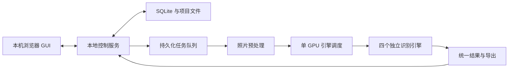

# 内网离线 OCR 工作台开发计划

## 1. 目标与交付形式

开发一套 **Windows 原生、单机使用、完全离线的 OCR 工作台**，面向 Xeon W5-2455X、64GB 内存、RTX A4000 16GB，重点支持手机照片、中英文印刷体、中文手写和拍摄表格。

采用 **“双击启动器＋本机浏览器 GUI＋独立模型进程”** 的方案。最终交付一个完整 ZIP，包含应用、四个模型、辅助模型和全部应用依赖。

目标电脑只需提前具备兼容的 NVIDIA 驱动，以及 Windows 自带的 Edge 或已安装的 Chrome。不要求安装 Python、Node.js、CUDA Toolkit、Docker、WSL，也不在首次启动时联网补文件。

首版边界：

- 支持单张识别及数百张图片批处理。
- 支持 JPG、PNG、BMP、TIFF、WebP、HEIC，所需解码库随包提供。
- 支持模型切换、顺序对比、图片预处理、文字校对、表格编辑和 Excel 导出。
- 自动保存本地项目，关闭后可以继续处理。
- 首版聚焦图片输入；PDF、多用户访问、模型训练和复杂 Office 外观还原留到后续版本。

## 2. 软件架构与四个识别引擎

前端采用 **React＋TypeScript＋Vite**，构建为静态资源随包提供；后端采用 **FastAPI＋SQLite**，负责项目、任务、结果和导出。

启动器使用 **PySide6 托盘＋PyInstaller onedir**，双击后启动后台并打开浏览器，提供退出和查看运行状态入口。服务只监听本机回环地址。

四个引擎采用以下固定路线：

| 引擎 | 首版职责 | Windows 推理路线 |
|---|---|---|
| **PP-OCRv6 medium** | 普通照片文字、印刷体、数字和字符坐标；快速模式默认引擎 | Paddle 原生推理 |
| **PaddleOCR-VL-1.6** | 表格、混合版面和结构化识别；表格模式默认引擎 | Paddle 完整解析管线，包含布局与结果组织 |
| **GLM-OCR** | 文字、表格识别的第二候选及交叉对比 | Transformers 本地 BF16，保留布局分析和区域识别流程 |
| **HunyuanOCR-1.5** | 中文手写及照片文字的另一候选；手写模式初始默认引擎 | Windows CUDA 版 llama.cpp，打包 F16 GGUF 和视觉投影模型 |

这些默认选择是初始操作预设，不代表未经测试的准确率排名。混元首版采用官方说明中的常规 llama.cpp 路线，暂不集成 DFlash。

引擎隔离与扩展方式：

- 每个引擎独立进程、独立运行环境、独立版本锁定；GPU 依赖不塞进启动器的 PyInstaller 包。
- A4000 同时只加载一个引擎；切换时退出旧进程释放显存。批量对比按引擎分组顺序执行，减少反复加载。
- 定义统一 `EngineAdapter`，提供能力声明、加载、识别、取消和卸载。
- 统一结果包含文字块、可用坐标、可用置信度、表格单元格及合并关系，同时保留模型原始输出。缺失字段明确留空，不伪造置信度，也不直接比较不同模型的置信度数值。
- 后续通过 GUI 导入完整“离线引擎包”：权重、适配器、依赖、能力声明和版本清单一起更新，主界面及业务脚本保持稳定。

## 3. GUI、照片处理与批量工作流

主界面采用中文工作台布局：左侧图片及任务列表，中间图片预览，右侧文字或表格结果；模型、模式和批量操作放在顶部。

**照片处理与识别**

- 支持拖放图片、选择文件夹、缩放、旋转、裁剪、四角透视校正和局部框选。
- 自动处理 EXIF 方向；去弯曲、对比度增强作为可选预处理，提供处理前后对照。
- 原图始终保留，预处理生成新版本。识别框标注所对应的图像版本，避免校正前后坐标错位。
- 提供“照片文字、手写、表格、模型对比”四种入口；每种入口显示适用模型。
- 点击文字块或表格区域可定位图片；支持框选困难区域，换模型重新识别。
- 对比模式保留各模型结果、耗时和文字差异，由用户选择采用的版本；不自动把多个结果混写成一份。

**文字和表格校对**

- 文字可编辑、复制、搜索，保留原始识别结果与人工修改。
- 表格支持单元格编辑、行列增删、合并与拆分、撤销与重做。
- 首版 Excel 还原重点是行列关系、文字、合并单元格和基本可读排版。
- 导出保留前导零、长编号及原始文本；不根据照片推断不可见公式。
- 支持 TXT、Markdown、JSON、XLSX。默认每张图片生成独立结果文件；一张图片内的多个表分别放入 Excel 工作表，也可将选中的表汇总为一个工作簿。

**数百张图片批处理**

- 批次一次设置模型和预处理预设，支持暂停、继续、取消、失败项重试及批量导出。
- SQLite 持久化任务状态；每完成一张立即保存，个别失败不阻塞整个批次。
- 重启后恢复批次列表，由用户继续未完成任务；已完成项不重复识别。
- CPU 预处理采用有限并发，GPU 识别串行；避免一次性解码数百张大图占满内存。
- 显存不足时终止当前项并释放引擎，保留错误及可重试状态，不静默降低识别质量。
- 编辑自动保存；原图、处理参数、引擎版本和结果可追溯，支持按项目清理占用空间。

## 4. 离线封装与维护

封装优先追求可靠性，不设置 ZIP 硬体积上限。

- 使用可搬迁 Python 运行时和随包依赖，通过相对路径启动；不直接复制开发机虚拟环境。
- 完整收集四个引擎、布局检测、方向分类、去畸变、分词器、配置、必要模型代码及原生 DLL。
- 前端资源全部本地化；模型加载使用明确的本地路径，关闭自动下载和遥测。
- 将应用版本与用户项目分离，更新应用或引擎时保留原图、结果和人工修改。
- 提供版本清单、文件哈希、许可证说明和离线自检工具；精确锁定库版本、模型 revision 和 llama.cpp 构建版本。
- 引擎包导入先校验、再暂存、最后切换版本，保留旧版本供回退。
- 启动自检检查驱动、GPU、显存、磁盘、模型完整性和依赖加载；错误界面直接说明缺少什么，不要求用户读 Python 堆栈。
- CUDA 用户态运行库随包携带；显卡驱动作为一次性系统准备，交付时给出验证过的版本要求。

发布前必须在**另一台无开发环境、禁止联网的 Windows 电脑**上验证解压运行，并测试更换盘符、中文路径和空格路径。A4000 的实际显存与速度在目标内网电脑上通过随包验收工具确认。

## 5. 开发阶段与验收

预计由一名熟悉 Python 和前端的工程师投入 **约 5–7 周**；先验证离线后端，再完善 GUI。

| 阶段 | 工作与交付 | 通过条件 |
|---|---|---|
| **第 1 周：兼容性验证** | 跑通四个 Windows 后端，验证完整解析与表格输出，制作最小便携包 | 四个引擎均能断网运行并搬迁目录；不能用占位菜单代替实际接入 |
| **第 2 周：应用基础** | 启动器、项目保存、任务队列、引擎接口、加载与切换 | 创建任务、取消、保存、恢复及进程退出正常 |
| **第 3–4 周：交互功能** | 图片校正、区域重识别、模型对比、文字和表格编辑、导出 | 完成“导入照片→识别→校对→Excel”的完整流程 |
| **第 5 周：批量与稳定性** | 数百张任务、失败恢复、显存管理、批量导出 | 连续处理 500 张测试图片；无持续内存增长，失败项可恢复 |
| **第 6–7 周：离线交付** | 干净机器验收、引擎包导入与回退、内网 A4000 验收、文档 | 最终 ZIP 满足离线解压运行，并输出兼容性和性能报告 |

验收分为工程与识别效果两部分：

- **工程验收**：四个模型切换、20 次连续加载卸载、500 张批次、损坏图片、超大图片、取消任务、异常退出恢复和中文路径均有覆盖。
- **表格验收**：无边框表、合并单元格、多表图片、空单元格、长编号、手写填表和透视照片；Excel 可打开，人工修改和合并关系正确保存。
- **效果评测**：准备不少于 200 张标注测试图片，分别报告印刷体 CER、手写 CER、关键字段完全正确率、表格结构指标和失败样例；另在内网真实样本上复核。
- **性能验收**：记录各模型冷启动、单张耗时、批量吞吐和峰值显存；默认配置以给 A4000 留出约 2GB 显存余量为目标。
- **保真验收**：封装结果与对应官方推理路线对照，任何差异需要定位；不通过自动润色掩盖识别错误。

最终交付物包括：完整离线 ZIP、源码与构建脚本、精确依赖及模型清单、使用说明、环境检查工具、测试样例和验收报告。首版定位为**可批量处理、可比较模型、可人工校对的离线 OCR 工具**，中文连笔手写的准确率以真实样本测试结果为准。
